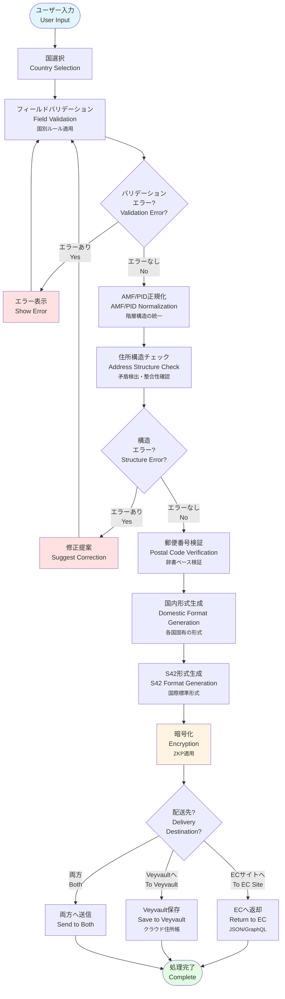
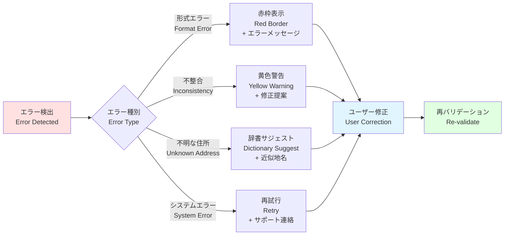

# Veyform住所処理パイプライン図 / Address Processing Pipeline Diagram

このドキュメントは、Veyformが入力を受け取ってから最終出力までの完全な処理フローを説明します。

This document explains the complete processing flow from input reception to final output in Veyform.

---

## 📊 住所処理パイプライン / Address Processing Pipeline



---

## 🔍 各ステップの詳細 / Step Details

### 1. ユーザー入力 / User Input
- **入力方法**: 手入力、Veyvault選択、QRコード読取、NFC読取
- **対応デバイス**: PC、スマートフォン、タブレット
- **入力支援**: 自動補完、住所サジェスト

### 2. 国選択 / Country Selection
- **3層構造**: 大陸 → 地域 → 国
- **自動検出**: IPアドレス、ブラウザ言語、ドメイン
- **手動選択**: 検索バー、絵文字国旗表示

### 3. フィールドバリデーション / Field Validation
- **リアルタイム検証**: 入力中にエラーチェック
- **国別ルール**: 各国の住所形式に対応
- **必須フィールド**: 国ごとに異なる必須項目

### 4. AMF/PID正規化 / AMF/PID Normalization
- **AMF (Address Metadata Format)**: 住所メタデータの標準化
- **PID (Place ID)**: 階層的な場所識別子
- **階層統一**: 国境を超えた統一的な階層構造

### 5. 住所構造チェック / Address Structure Check
- **矛盾検出**: 郵便番号と市区町村の不一致
- **整合性確認**: 都道府県と市区町村の関係性
- **地名辞書**: 公式地名データベースとの照合

### 6. 郵便番号検証 / Postal Code Verification
- **辞書ベース**: 各国の郵便番号データベース
- **自動補完**: 郵便番号から住所を自動入力
- **逆引き検証**: 住所から郵便番号を確認

### 7. 国内形式生成 / Domestic Format Generation
- **国別フォーマット**: 各国の標準的な住所表記
- **言語対応**: 現地語での住所表示
- **配送業者対応**: 国内配送業者の要求形式

### 8. S42形式生成 / S42 Format Generation
- **国際標準**: 国際配送向けの統一形式
- **多言語対応**: 英語・現地語の併記
- **ISO準拠**: ISO 3166-1/2に準拠した地域コード

### 9. 暗号化 / Encryption
- **ZKP (Zero-Knowledge Proof)**: ゼロ知識証明
- **エンドツーエンド**: 送信者から受信者まで暗号化
- **プライバシー保護**: 住所情報の保護

### 10. 配送先振り分け / Destination Routing
- **ECサイト**: 注文処理・配送手配
- **Veyvault**: クラウド住所帳への保存
- **両方**: 同時送信（注文＋保存）

---

## 🎯 処理時間の目安 / Processing Time Estimates

| ステップ | 処理時間 | 備考 |
|---------|---------|------|
| フィールドバリデーション | <100ms | リアルタイム |
| AMF/PID正規化 | <50ms | ローカル処理 |
| 住所構造チェック | <200ms | 辞書検索含む |
| S42形式生成 | <50ms | ローカル処理 |
| 暗号化 | <100ms | ZKP生成 |
| **合計** | **<500ms** | **サブセカンド応答** |

---

## 🔄 エラー処理フロー / Error Handling Flow



---

## 📝 使用例 / Usage Example

### JavaScript SDK

```javascript
import { Veyform } from '@vey/veyform-core';

const veyform = new Veyform({
  country: 'JP',
  language: 'ja',
  veyvaultIntegration: true
});

// 住所を処理
const result = await veyform.processAddress({
  postalCode: '100-0001',
  prefecture: '東京都',
  city: '千代田区',
  streetAddress: '千代田1-1'
});

console.log(result.domesticFormat); // 国内形式
console.log(result.s42Format);      // 国際形式 (S42)
console.log(result.pid);            // Place ID
```

### React Component

```tsx
import { VeyformAddressForm } from '@vey/veyform-react';

function CheckoutPage() {
  const handleSubmit = (result) => {
    console.log('処理完了:', result);
    // ECサイトへ送信
    submitOrder({
      ...orderData,
      shippingAddress: result.s42Format
    });
  };

  return (
    <VeyformAddressForm
      country="JP"
      onSubmit={handleSubmit}
      enableVeyvault={true}
      theme="modern"
    />
  );
}
```

---

## 🚀 パフォーマンス最適化 / Performance Optimization

### クライアントサイド最適化
1. **ローカルキャッシュ**: 国別住所データのキャッシング
2. **増分検証**: 変更されたフィールドのみ再検証
3. **非同期処理**: Web Workerでの並列処理
4. **遅延読み込み**: 必要な国データのみ読み込み

### サーバーサイド最適化
1. **CDN配信**: 住所データのCDN配信
2. **エッジコンピューティング**: 地域別エッジサーバー
3. **データベース最適化**: インデックス最適化
4. **キャッシング戦略**: Redis/Memcachedキャッシング

---

## 🔐 セキュリティ対策 / Security Measures

1. **入力サニタイゼーション**: XSS/SQLインジェクション対策
2. **レート制限**: DDoS攻撃防止
3. **暗号化通信**: HTTPS/TLS必須
4. **ZKP暗号化**: 住所データの暗号化
5. **アクセス制御**: RBAC (Role-Based Access Control)
6. **監査ログ**: すべての操作を記録

---

## 📊 監視・分析 / Monitoring & Analytics

### リアルタイム監視
- 処理時間の追跡
- エラー率の監視
- バリデーション失敗の分析
- パフォーマンスボトルネックの検出

### 分析データ
- 国別使用統計
- エラー種別の分布
- ユーザー操作フロー
- 変換成功率

---

## 関連ドキュメント / Related Documents

- [国別住所階層マップ](./02-country-address-hierarchy.md)
- [郵便番号補完フロー](./03-postal-code-autocomplete.md)
- [住所矛盾チェック](./04-address-validation-logic.md)
- [Validation多層図](./09-validation-layers.md)
