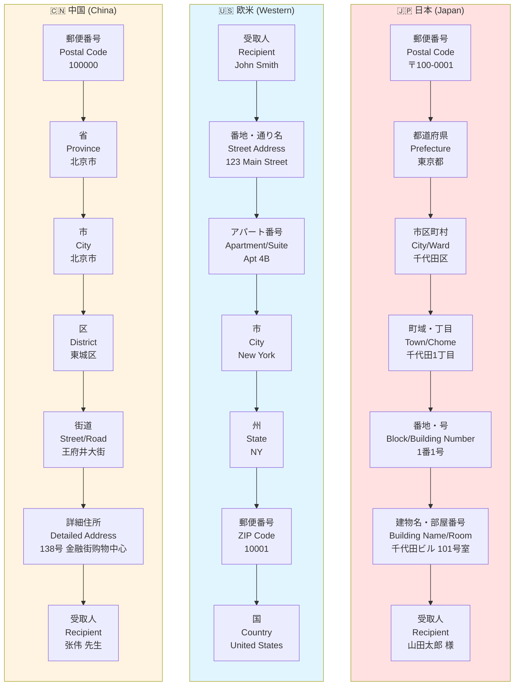
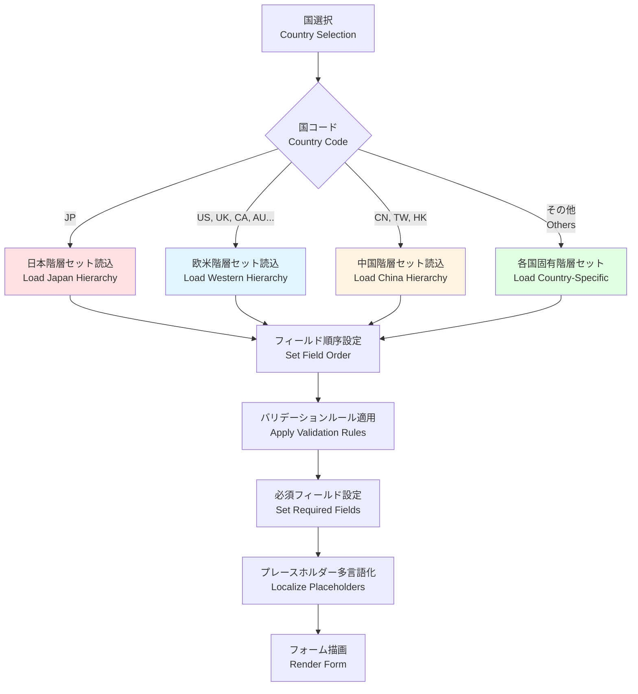

# 国別住所階層マップ / Country-Specific Address Hierarchy Map

このドキュメントは、日本、欧米、中国の代表的な住所構造の違いを比較し、Veyformがどのように国別で階層セットを自動切替するかを説明します。

This document compares the representative address structures of Japan, Western countries, and China, and explains how Veyform automatically switches hierarchy sets by country.

---

## 🌍 3カ国の住所階層比較 / Three-Country Address Hierarchy Comparison



---

## 📋 階層構造の詳細比較 / Detailed Hierarchy Comparison

### 🇯🇵 日本の住所階層 / Japanese Address Hierarchy

| レベル | 英語名 | 日本語名 | 例 | 必須 | PIDコード |
|--------|--------|----------|-----|------|-----------|
| 1 | Postal Code | 郵便番号 | 〒100-0001 | ✅ | - |
| 2 | Prefecture | 都道府県 | 東京都 | ✅ | JP-13 |
| 3 | City/Ward | 市区町村 | 千代田区 | ✅ | JP-13-13101 |
| 4 | Town/Chome | 町域・丁目 | 千代田1丁目 | ✅ | JP-13-13101-0001 |
| 5 | Block/Number | 番地・号 | 1番1号 | ✅ | - |
| 6 | Building/Room | 建物名・部屋番号 | 千代田ビル 101号室 | ❌ | - |
| 7 | Recipient | 受取人 | 山田太郎 様 | ✅ | - |

**特徴**:
- 大きい単位から小さい単位へ（逆ピラミッド構造）
- 郵便番号が最初
- 受取人名が最後
- 階層が明確に分かれている

**表示順序**:
```
〒100-0001
東京都千代田区千代田1-1-1
千代田ビル 101号室
山田太郎 様
```

---

### 🇺🇸 欧米の住所階層 / Western Address Hierarchy

| レベル | 英語名 | 例 | 必須 | PIDコード |
|--------|--------|-----|------|-----------|
| 1 | Recipient | John Smith | ✅ | - |
| 2 | Street Address | 123 Main Street | ✅ | - |
| 3 | Apartment/Suite | Apt 4B | ❌ | - |
| 4 | City | New York | ✅ | US-NY-NYC |
| 5 | State | NY | ✅ | US-NY |
| 6 | ZIP Code | 10001 | ✅ | - |
| 7 | Country | United States | ✅ | US |

**特徴**:
- 小さい単位から大きい単位へ（ピラミッド構造）
- 受取人名が最初
- 郵便番号が最後（国の前）
- 通り名が中心的な役割

**表示順序**:
```
John Smith
123 Main Street, Apt 4B
New York, NY 10001
United States
```

---

### 🇨🇳 中国の住所階層 / Chinese Address Hierarchy

| レベル | 英語名 | 中国語名 | 例 | 必須 | PIDコード |
|--------|--------|----------|-----|------|-----------|
| 1 | Postal Code | 郵便番号 | 100000 | ✅ | - |
| 2 | Province | 省/直轄市 | 北京市 | ✅ | CN-11 |
| 3 | City | 市 | 北京市 | ✅ | CN-11-110000 |
| 4 | District | 区 | 東城区 | ✅ | CN-11-110101 |
| 5 | Street/Road | 街道 | 王府井大街 | ✅ | - |
| 6 | Detailed Address | 詳細住所 | 138号 金融街购物中心 | ✅ | - |
| 7 | Recipient | 収件人 | 张伟 先生 | ✅ | - |

**特徴**:
- 日本と似た逆ピラミッド構造
- 省・市・区の3層構造
- 街道名が重要
- 詳細住所が複雑（建物名＋番号）

**表示順序**:
```
100000
北京市 東城区
王府井大街138号
金融街购物中心
张伟 先生 收
```

---

## 🔄 Veyformの自動切替メカニズム / Veyform's Automatic Switching Mechanism



---

## 📐 フィールドマッピング / Field Mapping

### 共通フィールドのマッピング例

| 概念 | 日本 | 欧米 | 中国 |
|------|------|------|------|
| 行政区画レベル1 | 都道府県 | State/Province | 省 |
| 行政区画レベル2 | 市区町村 | City | 市 |
| 行政区画レベル3 | 町域 | - | 区 |
| 通り/地番 | 丁目・番地 | Street Address | 街道 |
| 建物情報 | 建物名・部屋番号 | Apt/Suite | 详细地址 |
| 郵便番号 | 〒XXX-XXXX | ZIP/Postal Code | 邮政编码 |

---

## 🎯 バリデーションルールの違い / Validation Rule Differences

### 🇯🇵 日本
```javascript
{
  postalCode: {
    pattern: /^\d{3}-\d{4}$/,
    required: true,
    autoComplete: true // 郵便番号から住所を自動補完
  },
  prefecture: {
    type: 'select',
    options: 47, // 47都道府県
    required: true
  },
  city: {
    type: 'text',
    required: true,
    dependsOn: 'prefecture' // 都道府県に依存
  }
}
```

### 🇺🇸 欧米 (アメリカ)
```javascript
{
  zipCode: {
    pattern: /^\d{5}(-\d{4})?$/,
    required: true,
    autoComplete: true
  },
  state: {
    type: 'select',
    options: 50, // 50州
    required: true
  },
  city: {
    type: 'text',
    required: true
  },
  streetAddress: {
    type: 'text',
    required: true,
    placeholder: '123 Main Street'
  }
}
```

### 🇨🇳 中国
```javascript
{
  postalCode: {
    pattern: /^\d{6}$/,
    required: true
  },
  province: {
    type: 'select',
    options: 34, // 34省級行政区
    required: true
  },
  city: {
    type: 'select',
    required: true,
    dependsOn: 'province'
  },
  district: {
    type: 'select',
    required: true,
    dependsOn: 'city'
  }
}
```

---

## 🌐 PID (Place ID) の統一構造 / Unified PID Structure

すべての国で統一的なPID構造を使用:

```
{CountryCode}-{Level1}-{Level2}-{Level3}-{Level4}
```

### 例 / Examples

**日本**:
```
JP-13-13101-0001
│  │  │     └─ 町域コード (Town Code)
│  │  └─────── 市区町村コード (City Code)
│  └────────── 都道府県コード (Prefecture Code)
└───────────── 国コード (Country Code)
```

**アメリカ**:
```
US-NY-NYC-10001
│  │  │   └─ ZIP Code
│  │  └───── City Code
│  └──────── State Code
└─────────── Country Code
```

**中国**:
```
CN-11-110101-100000
│  │  │      └─ Postal Code
│  │  └──────── District Code
│  └─────────── Province Code
└────────────── Country Code
```

---

## 🔧 実装例 / Implementation Example

### React Component

```tsx
import { VeyformAddressForm } from '@vey/veyform-react';

function MultiCountryCheckout() {
  const [country, setCountry] = useState('JP');
  
  return (
    <div>
      <CountrySelector 
        value={country}
        onChange={setCountry}
      />
      
      <VeyformAddressForm
        country={country}
        // 国が変わると自動的に階層構造が切り替わる
        onSubmit={(address) => {
          console.log('国内形式:', address.domesticFormat);
          console.log('S42形式:', address.s42Format);
          console.log('PID:', address.pid);
        }}
      />
    </div>
  );
}
```

### JavaScript SDK

```javascript
import { Veyform } from '@vey/veyform-core';

// 日本用フォーム
const jpForm = new Veyform({ country: 'JP' });
console.log(jpForm.getHierarchy());
// => ['postalCode', 'prefecture', 'city', 'town', 'block', 'building', 'recipient']

// アメリカ用フォーム
const usForm = new Veyform({ country: 'US' });
console.log(usForm.getHierarchy());
// => ['recipient', 'streetAddress', 'apartment', 'city', 'state', 'zipCode', 'country']

// 中国用フォーム
const cnForm = new Veyform({ country: 'CN' });
console.log(cnForm.getHierarchy());
// => ['postalCode', 'province', 'city', 'district', 'street', 'detailedAddress', 'recipient']
```

---

## 📊 対応国数と階層パターン / Supported Countries and Hierarchy Patterns

### 階層パターンの分類

| パターン | 国数 | 代表国 | 特徴 |
|----------|------|--------|------|
| 日本型 | 5 | 🇯🇵日本、🇰🇷韓国 | 大→小、郵便番号優先 |
| 欧米型 | 120+ | 🇺🇸米国、🇬🇧英国、🇨🇦カナダ、🇦🇺豪州 | 小→大、通り名中心 |
| 中国型 | 8 | 🇨🇳中国、🇹🇼台湾、🇭🇰香港 | 大→小、行政区画重視 |
| 中東型 | 20+ | 🇸🇦サウジ、🇦🇪UAE | 地区名重視 |
| アフリカ型 | 50+ | 🇿🇦南アフリカ、🇰🇪ケニア | シンプル構造 |
| 島嶼型 | 15+ | 🇲🇻モルディブ、🇫🇯フィジー | 島・環礁ベース |

### 全269カ国・地域対応
- **完全対応**: 180カ国（フル階層データ）
- **基本対応**: 89地域（基本階層のみ）
- **特殊対応**: 南極、海域など

---

## 🚀 パフォーマンス最適化 / Performance Optimization

### 遅延読み込み (Lazy Loading)
```javascript
// 選択された国のデータのみ読み込む
const loadCountryData = async (countryCode) => {
  const data = await import(`@vey/address-data/${countryCode}`);
  return data.default;
};
```

### キャッシング
```javascript
const cache = new Map();

function getCountryHierarchy(countryCode) {
  if (cache.has(countryCode)) {
    return cache.get(countryCode);
  }
  
  const hierarchy = loadCountryData(countryCode);
  cache.set(countryCode, hierarchy);
  return hierarchy;
}
```

---

## 関連ドキュメント / Related Documents

- [住所処理パイプライン](./01-address-processing-pipeline.md)
- [郵便番号補完フロー](./03-postal-code-autocomplete.md)
- [PID階層ツリー](./07-pid-hierarchical-tree.md)
- [Validation多層図](./09-validation-layers.md)
