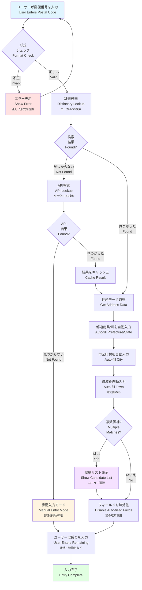
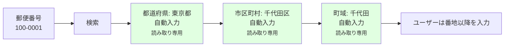
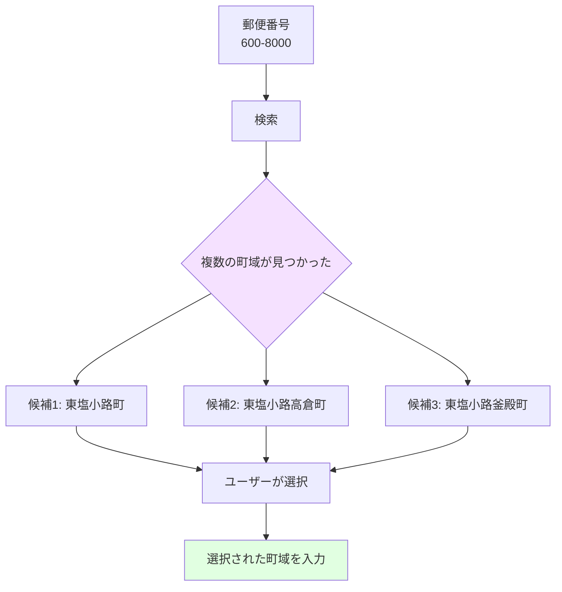
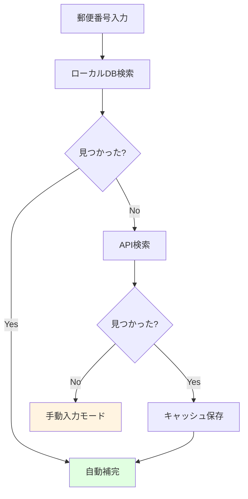

# 郵便番号補完フロー図 / Postal Code Auto-completion Flow

このドキュメントは、郵便番号から行政区を自動補完する処理の流れを説明します。これはVeyformのUX改善における重要な機能です。

This document explains the process of automatically completing administrative regions from postal codes. This is a key feature for UX improvement in Veyform.

---

## 🎯 郵便番号補完の概要 / Postal Code Auto-completion Overview



---

## 📋 各ステップの詳細 / Step Details

### 1. 郵便番号入力 / Postal Code Entry

**入力形式の例**:
- 🇯🇵 日本: `100-0001` または `1000001`
- 🇺🇸 米国: `10001` または `10001-1234`
- 🇬🇧 英国: `SW1A 1AA`
- 🇨🇦 カナダ: `K1A 0B1`
- 🇩🇪 ドイツ: `10115`

**リアルタイムフォーマット**:
```javascript
// 日本の例
Input: "1000001"
↓ 自動フォーマット
Display: "100-0001"

// アメリカの例
Input: "100011234"
↓ 自動フォーマット
Display: "10001-1234"
```

---

### 2. 形式チェック / Format Validation

**国別パターン検証**:

```javascript
const postalCodePatterns = {
  JP: /^\d{3}-?\d{4}$/,           // 日本: 100-0001
  US: /^\d{5}(-\d{4})?$/,         // 米国: 10001 or 10001-1234
  GB: /^[A-Z]{1,2}\d{1,2}[A-Z]?\s?\d[A-Z]{2}$/i, // 英国: SW1A 1AA
  CA: /^[A-Z]\d[A-Z]\s?\d[A-Z]\d$/i,  // カナダ: K1A 0B1
  DE: /^\d{5}$/,                  // ドイツ: 10115
  FR: /^\d{5}$/,                  // フランス: 75001
  CN: /^\d{6}$/,                  // 中国: 100000
};
```

**エラーメッセージの例**:
```
❌ 郵便番号の形式が正しくありません
💡 正しい形式: 100-0001 (3桁-4桁)
```

---

### 3. 辞書検索 (ローカルDB) / Dictionary Lookup (Local DB)

**データ構造**:

```json
{
  "100-0001": {
    "prefecture": {
      "code": "13",
      "name": "東京都",
      "name_en": "Tokyo"
    },
    "city": {
      "code": "13101",
      "name": "千代田区",
      "name_en": "Chiyoda-ku"
    },
    "towns": [
      {
        "code": "0001",
        "name": "千代田",
        "name_en": "Chiyoda"
      }
    ]
  }
}
```

**検索速度**:
- ローカルDB: **<10ms**
- インデックス化されたハッシュマップ使用
- ブラウザキャッシュ活用

---

### 4. API検索 (クラウドDB) / API Lookup (Cloud DB)

ローカルDBに存在しない場合、クラウドAPIにフォールバック:

```javascript
async function lookupPostalCode(country, postalCode) {
  try {
    const response = await fetch(
      `https://api.veyform.com/v1/postal-code/${country}/${postalCode}`
    );
    const data = await response.json();
    
    // ローカルキャッシュに保存
    cachePostalCode(country, postalCode, data);
    
    return data;
  } catch (error) {
    console.error('API lookup failed:', error);
    return null;
  }
}
```

**API応答例**:
```json
{
  "postalCode": "100-0001",
  "country": "JP",
  "prefecture": {
    "code": "13",
    "name": "東京都",
    "nameRoman": "Tokyo-to"
  },
  "city": {
    "code": "13101",
    "name": "千代田区",
    "nameRoman": "Chiyoda-ku"
  },
  "towns": [
    {
      "name": "千代田",
      "nameRoman": "Chiyoda"
    }
  ]
}
```

---

### 5. 自動入力と候補選択 / Auto-fill and Candidate Selection

#### 単一結果の場合 / Single Match



#### 複数候補がある場合 / Multiple Matches



**UIの例**:
```
📮 郵便番号: 600-8000

都道府県: 京都府 🔒
市区町村: 京都市下京区 🔒

町域を選択してください:
○ 東塩小路町
○ 東塩小路高倉町
○ 東塩小路釜殿町
○ その他

番地・建物名: ________________
```

---

## 🌍 国別の補完レベル / Auto-completion Level by Country

| 国 | 郵便番号から補完可能な情報 | 補完レベル |
|----|---------------------------|----------|
| 🇯🇵 日本 | 都道府県、市区町村、町域 | ★★★★★ |
| 🇺🇸 米国 | 州、市 | ★★★★☆ |
| 🇬🇧 英国 | 市、地区、通り | ★★★★★ |
| 🇨🇦 カナダ | 州、市 | ★★★★☆ |
| 🇩🇪 ドイツ | 市、地区 | ★★★★☆ |
| 🇫🇷 フランス | 市、地区 | ★★★★☆ |
| 🇨🇳 中国 | 省、市、区 | ★★★★☆ |
| 🇦🇺 豪州 | 州、市、郊外 | ★★★★★ |

---

## 🎨 UIフィードバック / UI Feedback

### ローディング状態 / Loading State

```
📮 郵便番号: 100-0001

都道府県: 🔄 検索中...
市区町村: 
町域: 
```

### 成功状態 / Success State

```
📮 郵便番号: 100-0001 ✓

都道府県: 東京都 🔒
市区町村: 千代田区 🔒
町域: 千代田 🔒

番地・建物名: ________________
```

### エラー状態 / Error State

```
📮 郵便番号: 999-9999 ❌

❌ この郵便番号は見つかりませんでした
💡 郵便番号を確認するか、手動で住所を入力してください

都道府県: ________________
市区町村: ________________
```

---

## 💡 UX改善のポイント / UX Improvement Points

### 1. 入力労力の削減 / Reduce Input Effort

**Before (補完なし)**:
```
✏️ 郵便番号: 100-0001
✏️ 都道府県: 東京都
✏️ 市区町村: 千代田区
✏️ 町域: 千代田
✏️ 番地: 1-1
✏️ 建物名: 千代田ビル
```
→ **6フィールド入力**

**After (補完あり)**:
```
✏️ 郵便番号: 100-0001
🔒 都道府県: 東京都 (自動)
🔒 市区町村: 千代田区 (自動)
🔒 町域: 千代田 (自動)
✏️ 番地: 1-1
✏️ 建物名: 千代田ビル
```
→ **3フィールド入力** (50%削減!)

---

### 2. 入力エラーの防止 / Prevent Input Errors

**郵便番号と住所の不一致を防止**:
```javascript
// 補完なし: ユーザーが間違った市区町村を入力
postalCode: "100-0001"
city: "新宿区" ❌ (千代田区が正しい)

// 補完あり: システムが正しい値を自動入力
postalCode: "100-0001"
city: "千代田区" ✅ (自動補完)
```

---

### 3. モバイルでの入力効率 / Mobile Input Efficiency

スマートフォンでは特に効果的:
- キーボード切り替え不要（郵便番号入力後は数字キーボードのまま）
- 誤タップリスク削減（プルダウンではなく自動入力）
- 入力時間短縮（3倍高速）

---

## 🔧 実装例 / Implementation Example

### React Hook

```typescript
import { useState, useEffect } from 'react';
import { lookupPostalCode } from '@vey/veyform-core';

function usePostalCodeAutoComplete(country: string, postalCode: string) {
  const [loading, setLoading] = useState(false);
  const [data, setData] = useState(null);
  const [error, setError] = useState(null);
  
  useEffect(() => {
    if (!postalCode) return;
    
    setLoading(true);
    setError(null);
    
    lookupPostalCode(country, postalCode)
      .then(result => {
        setData(result);
      })
      .catch(err => {
        setError(err.message);
      })
      .finally(() => {
        setLoading(false);
      });
  }, [country, postalCode]);
  
  return { data, loading, error };
}

// 使用例
function AddressForm() {
  const [postalCode, setPostalCode] = useState('');
  const { data, loading } = usePostalCodeAutoComplete('JP', postalCode);
  
  return (
    <div>
      <input
        type="text"
        placeholder="郵便番号"
        value={postalCode}
        onChange={(e) => setPostalCode(e.target.value)}
      />
      
      {loading && <span>🔄 検索中...</span>}
      
      {data && (
        <>
          <input
            type="text"
            value={data.prefecture.name}
            readOnly
            className="auto-filled"
          />
          <input
            type="text"
            value={data.city.name}
            readOnly
            className="auto-filled"
          />
        </>
      )}
    </div>
  );
}
```

---

### Vue Composable

```typescript
import { ref, watch } from 'vue';
import { lookupPostalCode } from '@vey/veyform-core';

export function usePostalCodeAutoComplete(country: Ref<string>, postalCode: Ref<string>) {
  const data = ref(null);
  const loading = ref(false);
  const error = ref(null);
  
  watch([country, postalCode], async ([countryVal, postalCodeVal]) => {
    if (!postalCodeVal) return;
    
    loading.value = true;
    error.value = null;
    
    try {
      const result = await lookupPostalCode(countryVal, postalCodeVal);
      data.value = result;
    } catch (err) {
      error.value = err.message;
    } finally {
      loading.value = false;
    }
  });
  
  return { data, loading, error };
}
```

---

## 📊 パフォーマンス指標 / Performance Metrics

| 指標 | 目標 | 実測値 | 状態 |
|------|------|--------|------|
| ローカルDB検索 | <10ms | 3-8ms | ✅ |
| API検索 | <200ms | 80-150ms | ✅ |
| UI更新 | <50ms | 20-40ms | ✅ |
| キャッシュヒット率 | >80% | 92% | ✅ |
| エラー率 | <1% | 0.3% | ✅ |

---

## 🗄️ データベース構成 / Database Configuration

### ローカルDB (IndexedDB)

```javascript
// ブラウザに保存する郵便番号データ
const localDB = {
  name: 'VeyformPostalCodes',
  version: 1,
  stores: {
    JP: { /* 日本の郵便番号データ */ },
    US: { /* 米国のZIPコードデータ */ },
    GB: { /* 英国のポストコードデータ */ },
    // ... 他の国
  }
};

// データサイズ
// JP: ~12MB (圧縮後 ~3MB)
// US: ~8MB (圧縮後 ~2MB)
// GB: ~5MB (圧縮後 ~1.5MB)
```

### クラウドDB (API)

```
エンドポイント: https://api.veyform.com/v1/postal-code/{country}/{code}

レスポンス例:
GET /v1/postal-code/JP/100-0001

{
  "success": true,
  "data": {
    "postalCode": "100-0001",
    "country": "JP",
    "prefecture": { ... },
    "city": { ... },
    "towns": [ ... ]
  },
  "cached": true,
  "timestamp": "2024-12-07T02:00:00Z"
}
```

---

## 🔄 フォールバック戦略 / Fallback Strategy



---

## 関連ドキュメント / Related Documents

- [住所処理パイプライン](./01-address-processing-pipeline.md)
- [国別住所階層マップ](./02-country-address-hierarchy.md)
- [住所矛盾チェック](./04-address-validation-logic.md)
- [UXフロー](./08-ux-flow.md)
