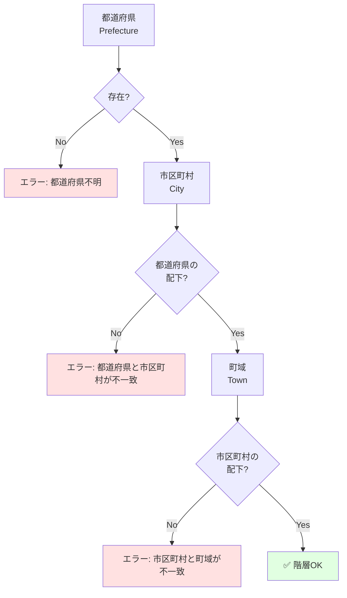
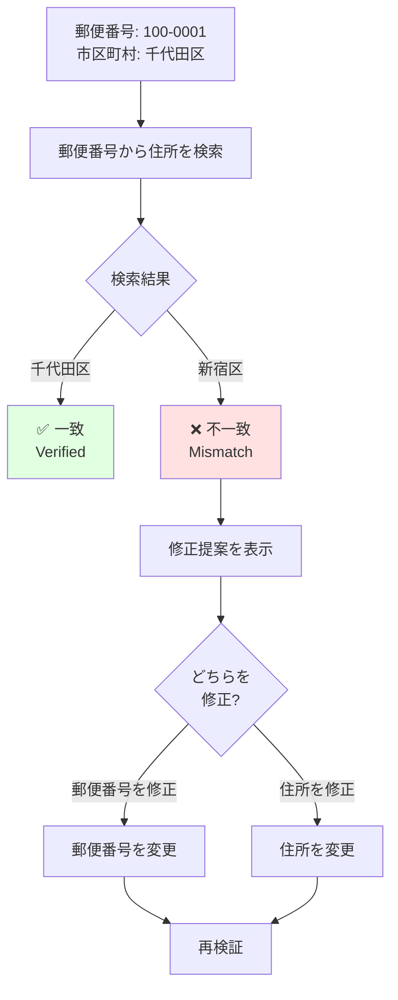
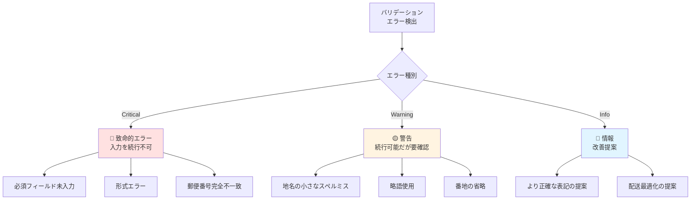
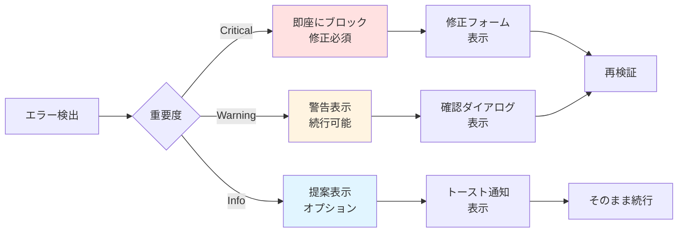

# 住所矛盾チェック (Validation AI) ロジック図 / Address Validation Logic Diagram

このドキュメントは、郵便番号と市区町村の不一致、スペルミス、番地の存在チェックなど、住所の矛盾をどの層で検査するかを説明します。

This document explains which layers check for address inconsistencies such as postal code-city mismatches, spelling errors, and block number validation.

---

## 🔍 多層バリデーションアーキテクチャ / Multi-Layer Validation Architecture

```mermaid
flowchart TD
    Input[住所入力<br/>Address Input] --> L1[Layer 1: 形式チェック<br/>Format Validation]
    
    L1 --> C1{形式<br/>OK?}
    C1 -->|NG| E1[エラー: 形式不正<br/>Format Error]
    E1 --> Fix1[修正提案]
    Fix1 --> Input
    
    C1 -->|OK| L2[Layer 2: 階層整合性チェック<br/>Hierarchy Consistency<br/><small>AMF検証</small>]
    
    L2 --> C2{整合性<br/>OK?}
    C2 -->|NG| E2[エラー: 階層不整合<br/>Hierarchy Error]
    E2 --> Fix2[構造修正提案]
    Fix2 --> Input
    
    C2 -->|OK| L3[Layer 3: 地名辞書チェック<br/>Place Name Dictionary<br/><small>公式データベース照合</small>]
    
    L3 --> C3{辞書<br/>一致?}
    C3 -->|不一致| W3[警告: 地名不明<br/>Unknown Place]
    W3 --> L4
    
    C3 -->|一致| L4[Layer 4: 郵便番号検証<br/>Postal Code Verification<br/><small>クロスチェック</small>]
    
    L4 --> C4{郵便番号<br/>一致?}
    C4 -->|不一致| E4[エラー: 郵便番号不一致<br/>Postal Code Mismatch]
    E4 --> Fix4[正しい組み合わせ提案]
    Fix4 --> Input
    
    C4 -->|一致| L5[Layer 5: AI補正 (オプション)<br/>AI Correction<br/><small>機械学習モデル</small>]
    
    L5 --> C5{AI提案<br/>あり?}
    C5 -->|あり| W5[提案: より正確な表記<br/>Suggested Improvement]
    W5 --> Confirm[ユーザー確認]
    Confirm -->|承認| Valid
    Confirm -->|拒否| Valid
    
    C5 -->|なし| Valid[✅ 検証完了<br/>Validation Complete]
    
    Valid --> Output[正規化された住所<br/>Normalized Address]
    
    style Input fill:#e1f5ff
    style Output fill:#e1ffe1
    style E1 fill:#ffe1e1
    style E2 fill:#ffe1e1
    style E4 fill:#ffe1e1
    style W3 fill:#fff4e1
    style W5 fill:#f5e1ff
```

---

## 📋 各レイヤーの詳細 / Layer Details

### Layer 1: 形式チェック / Format Validation

**目的**: 基本的な入力形式の妥当性を検証

**チェック項目**:

#### 郵便番号形式
```javascript
const formatChecks = {
  JP: {
    postalCode: {
      pattern: /^\d{3}-?\d{4}$/,
      error: "郵便番号は XXX-XXXX 形式で入力してください",
      example: "100-0001"
    }
  },
  US: {
    zipCode: {
      pattern: /^\d{5}(-\d{4})?$/,
      error: "ZIP code must be XXXXX or XXXXX-XXXX",
      example: "10001 or 10001-1234"
    }
  },
  GB: {
    postcode: {
      pattern: /^[A-Z]{1,2}\d{1,2}[A-Z]?\s?\d[A-Z]{2}$/i,
      error: "Postcode format must be like SW1A 1AA",
      example: "SW1A 1AA"
    }
  }
};
```

#### 文字種チェック
```javascript
// 不正な文字の検出
const invalidCharacters = {
  JP: {
    prefecture: /[^ぁ-んァ-ヶー一-龥々〆〤]/,
    // 都道府県は日本語のみ
  },
  US: {
    streetAddress: /[^a-zA-Z0-9\s\-\.#]/,
    // 英数字と基本記号のみ
  }
};
```

#### 必須フィールド
```javascript
const requiredFields = {
  JP: ['postalCode', 'prefecture', 'city', 'streetAddress'],
  US: ['streetAddress', 'city', 'state', 'zipCode'],
  GB: ['addressLine1', 'townCity', 'postcode']
};
```

**検証例**:
```
❌ 郵便番号: "abc-defg"
→ エラー: 郵便番号は数字で入力してください

❌ 郵便番号: "12345678"
→ エラー: 郵便番号は XXX-XXXX 形式で入力してください

✅ 郵便番号: "100-0001"
→ OK
```

---

### Layer 2: 階層整合性チェック / Hierarchy Consistency Check

**目的**: AMF (Address Metadata Format) に基づく階層構造の整合性検証

**チェック項目**:

#### 親子関係の検証
```javascript
// 例: 千代田区は東京都に属する
const hierarchyCheck = {
  prefecture: "東京都",
  city: "千代田区"
};

// 検証
if (!isPrefectureCity("東京都", "千代田区")) {
  throw new ValidationError(
    "千代田区は東京都に存在しません"
  );
}
```

#### 階層レベルの検証


**検証例**:
```javascript
// ❌ 不整合な例
{
  prefecture: "東京都",
  city: "大阪市"  // 東京都に大阪市は存在しない
}
→ エラー: "大阪市は東京都に存在しません"

// ✅ 正しい例
{
  prefecture: "東京都",
  city: "千代田区"
}
→ OK
```

---

### Layer 3: 地名辞書チェック / Place Name Dictionary Check

**目的**: 公式の地名データベースと照合

**データソース**:
- 日本: 国土交通省 位置参照情報
- 米国: USPS Address Database
- 英国: Royal Mail Postcode Address File
- その他: Google libaddressinput API

**チェック項目**:

#### 地名の存在確認
```javascript
async function checkPlaceName(country, city, town) {
  const dictionary = await loadDictionary(country);
  
  // 完全一致
  if (dictionary.exact.has(city)) {
    return { valid: true, confidence: 1.0 };
  }
  
  // 類似検索
  const similar = findSimilar(city, dictionary.all);
  if (similar.length > 0) {
    return {
      valid: false,
      suggestions: similar,
      confidence: 0.7
    };
  }
  
  // 見つからない
  return {
    valid: false,
    confidence: 0,
    error: "地名が見つかりません"
  };
}
```

#### スペルミス検出
```javascript
// レーベンシュタイン距離でスペルミスを検出
const cityInput = "千代他区";  // ユーザー入力 (誤)
const correctCity = "千代田区";  // 正しい地名

const distance = levenshteinDistance(cityInput, correctCity);
// distance = 1 (1文字違い)

if (distance <= 2) {
  suggest(`「${correctCity}」の間違いではありませんか？`);
}
```

**検証例**:
```
入力: "千代他区"
↓
🔍 辞書検索
↓
⚠️ 警告: 「千代田区」の間違いではありませんか？
   
   [ 修正する ]  [ このまま続ける ]
```

---

### Layer 4: 郵便番号検証 / Postal Code Verification

**目的**: 郵便番号と住所のクロスチェック

**検証フロー**:



**検証ロジック**:

```javascript
async function verifyPostalCode(postalCode, prefecture, city) {
  // 郵便番号から正しい住所を取得
  const correctAddress = await lookupPostalCode(postalCode);
  
  // 都道府県チェック
  if (correctAddress.prefecture !== prefecture) {
    return {
      valid: false,
      error: 'postal_prefecture_mismatch',
      message: `郵便番号 ${postalCode} は ${correctAddress.prefecture} です`,
      suggestion: {
        field: 'prefecture',
        value: correctAddress.prefecture
      }
    };
  }
  
  // 市区町村チェック
  if (correctAddress.city !== city) {
    return {
      valid: false,
      error: 'postal_city_mismatch',
      message: `郵便番号 ${postalCode} は ${correctAddress.city} です`,
      suggestion: {
        field: 'city',
        value: correctAddress.city
      }
    };
  }
  
  return { valid: true };
}
```

**エラー表示例**:

```
❌ 郵便番号と住所が一致しません

郵便番号: 100-0001
入力された住所: 東京都 新宿区
正しい住所: 東京都 千代田区

どちらを修正しますか？

[ 郵便番号を修正 ]  [ 住所を修正 ]  [ 手動で修正 ]
```

---

### Layer 5: AI補正 (オプション) / AI Correction (Optional)

**目的**: 機械学習モデルによる高度な補正提案

**AI機能**:

#### 1. 略語・通称の展開
```javascript
const aiCorrection = {
  input: "都庁前",
  suggestion: "東京都庁前",
  confidence: 0.95,
  reason: "一般的な略称を検出"
};
```

#### 2. 文脈に基づく補完
```javascript
// 入力
const input = {
  city: "千代田区",
  building: "霞が関ビル"
};

// AI提案
const suggestion = {
  town: "霞が関",  // 建物名から町域を推測
  confidence: 0.88
};
```

#### 3. 配送実績に基づく修正
```javascript
// 過去の配送データから学習
const deliveryHistory = {
  "千代田1-1-1": {
    successRate: 0.98,
    commonBuilding: "千代田ビル"
  },
  "千代田1-1": {
    successRate: 0.45,
    issue: "番地が不完全"
  }
};

// 提案
if (input.address === "千代田1-1") {
  suggest("「千代田1-1-1」の可能性があります");
}
```

**AI提案の表示**:

```
💡 AI提案

入力された住所:
東京都千代田区千代田1-1

より正確な表記:
東京都千代田区千代田1丁目1番1号
                    ↑追加↑

この提案を適用しますか？
[ 適用する ]  [ このまま続ける ]

※この提案は過去の配送実績に基づいています (信頼度: 88%)
```

---

## 🎯 エラーの優先度 / Error Priority



---

## 📊 検証統計 / Validation Statistics

### 実際のエラー分布

| エラー種別 | 発生率 | 自動修正可能 |
|-----------|--------|-------------|
| 郵便番号形式エラー | 8% | ✅ 95% |
| 郵便番号-住所不一致 | 5% | ✅ 90% |
| 地名スペルミス | 12% | ✅ 85% |
| 必須フィールド未入力 | 3% | ❌ 0% |
| 階層不整合 | 2% | ✅ 75% |
| その他 | 1% | ⚠️ 50% |

### 検証パフォーマンス

| レイヤー | 処理時間 | 成功率 |
|---------|---------|--------|
| Layer 1 (形式) | <5ms | 99.8% |
| Layer 2 (階層) | <10ms | 99.5% |
| Layer 3 (辞書) | <50ms | 98.7% |
| Layer 4 (郵便番号) | <100ms | 99.2% |
| Layer 5 (AI) | <200ms | 95.0% |

---

## 🔧 実装例 / Implementation Example

### フルバリデーション

```typescript
import { VeyformValidator } from '@vey/veyform-core';

async function validateAddress(address: AddressInput) {
  const validator = new VeyformValidator({
    country: 'JP',
    enableAI: true
  });
  
  // 各レイヤーを順番に実行
  const results = {
    format: await validator.checkFormat(address),
    hierarchy: await validator.checkHierarchy(address),
    dictionary: await validator.checkDictionary(address),
    postalCode: await validator.checkPostalCode(address),
    ai: await validator.checkAI(address)
  };
  
  // エラーを収集
  const errors = Object.values(results)
    .filter(r => !r.valid)
    .map(r => r.error);
  
  // 警告を収集
  const warnings = Object.values(results)
    .filter(r => r.warnings)
    .flatMap(r => r.warnings);
  
  // 提案を収集
  const suggestions = Object.values(results)
    .filter(r => r.suggestions)
    .flatMap(r => r.suggestions);
  
  return {
    valid: errors.length === 0,
    errors,
    warnings,
    suggestions
  };
}
```

### React Component

```tsx
import { VeyformAddressForm } from '@vey/veyform-react';

function CheckoutPage() {
  return (
    <VeyformAddressForm
      country="JP"
      validation={{
        realtime: true,        // リアルタイム検証
        levels: [
          'format',
          'hierarchy',
          'dictionary',
          'postalCode',
          'ai'
        ],
        aiEnabled: true,       // AI補正を有効化
        showSuggestions: true  // 提案を表示
      }}
      onValidationError={(errors) => {
        console.log('Validation errors:', errors);
      }}
      onValidationWarning={(warnings) => {
        console.log('Validation warnings:', warnings);
      }}
    />
  );
}
```

---

## 🚨 エラーハンドリング戦略 / Error Handling Strategy

### 段階的な対応



---

## 関連ドキュメント / Related Documents

- [住所処理パイプライン](./01-address-processing-pipeline.md)
- [郵便番号補完フロー](./03-postal-code-autocomplete.md)
- [Validation多層図](./09-validation-layers.md)
- [UXフロー](./08-ux-flow.md)
