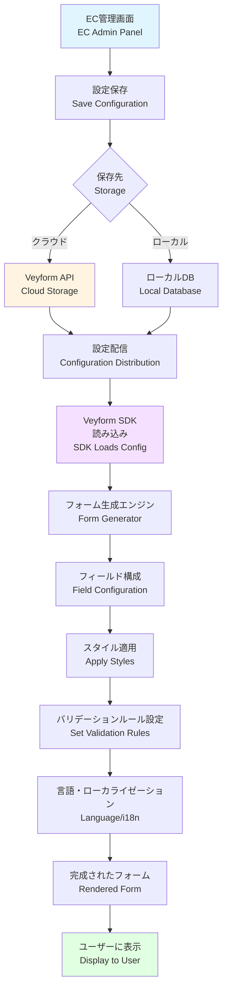
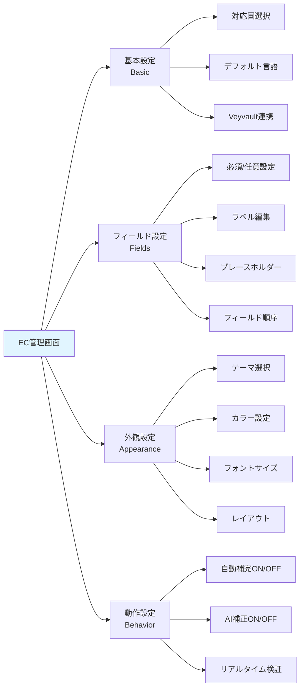
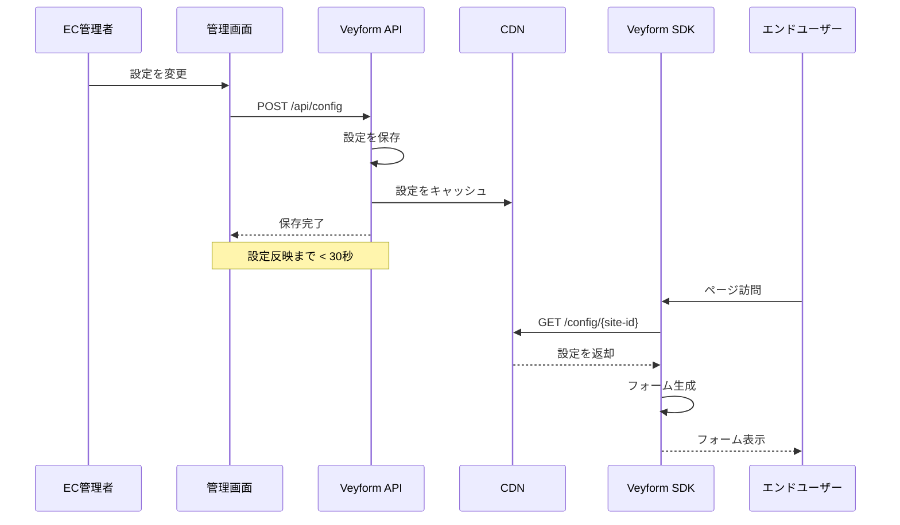
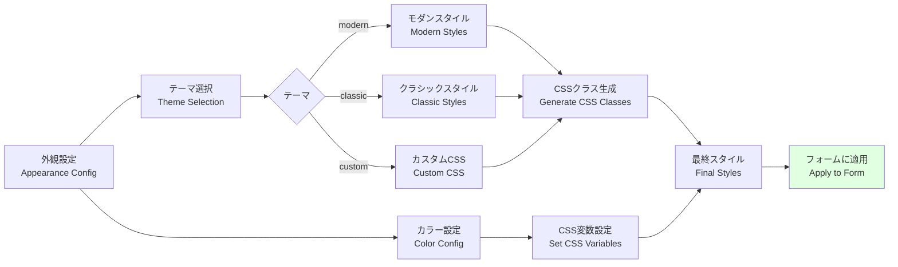
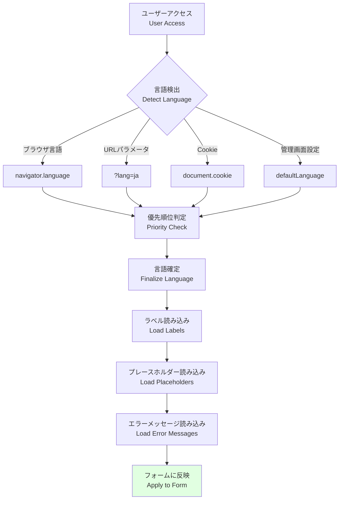
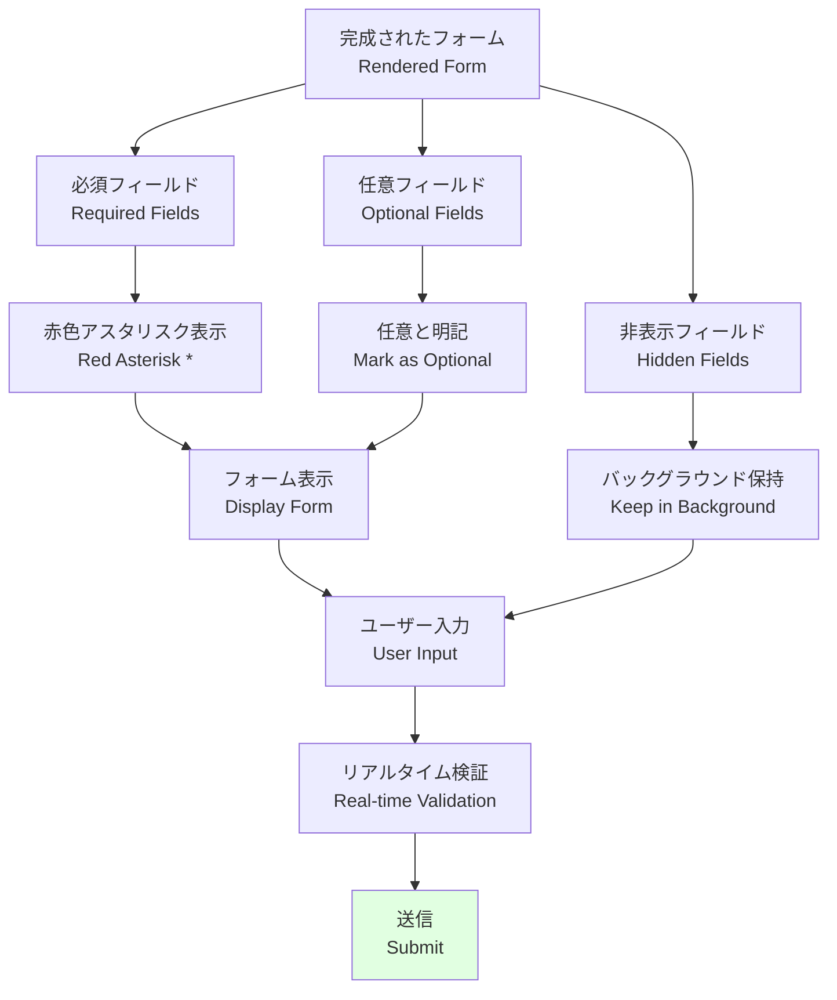
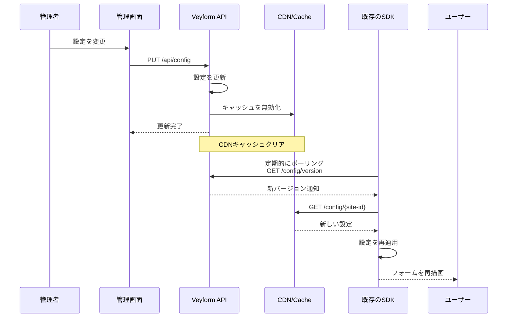

# EC管理画面 → Veyform SDK → UI の関係図 / EC Admin Panel → Veyform SDK → UI Relationship

このドキュメントは、ECサイトの管理画面での設定がVeyform SDKに反映され、最終的にユーザー向けフォームに表示されるまでの流れを説明します。

This document explains the flow from EC site admin panel configuration to Veyform SDK reflection and final user-facing form display.

---

## 🎯 全体フロー / Overall Flow



---

## 🖥️ EC管理画面 / EC Admin Panel

### 設定可能な項目 / Configurable Settings



### 管理画面のUI例

```typescript
interface VeyformAdminConfig {
  // 基本設定
  basic: {
    supportedCountries: string[];      // ['JP', 'US', 'GB', ...]
    defaultLanguage: Language;         // 'ja' | 'en' | ...
    veyvaultIntegration: boolean;      // Veyvault連携
    apiKey: string;                    // APIキー
  };
  
  // フィールド設定
  fields: {
    [fieldName: string]: {
      enabled: boolean;                // フィールド表示/非表示
      required: boolean;               // 必須/任意
      label: {
        [lang: string]: string;        // ラベルの多言語対応
      };
      placeholder: {
        [lang: string]: string;        // プレースホルダーの多言語対応
      };
      order: number;                   // 表示順序
      validation: {
        pattern?: string;              // 正規表現
        minLength?: number;
        maxLength?: number;
        custom?: string;               // カスタム検証関数
      };
    };
  };
  
  // 外観設定
  appearance: {
    theme: 'modern' | 'classic' | 'minimal' | 'custom';
    colors: {
      primary: string;                 // プライマリカラー
      error: string;                   // エラーカラー
      success: string;                 // 成功カラー
      border: string;                  // ボーダーカラー
    };
    fonts: {
      family: string;                  // フォントファミリー
      size: {
        label: string;                 // ラベルサイズ
        input: string;                 // 入力欄サイズ
      };
    };
    layout: 'vertical' | 'horizontal' | 'grid';
    spacing: 'compact' | 'normal' | 'relaxed';
  };
  
  // 動作設定
  behavior: {
    autoComplete: boolean;             // 自動補完
    aiCorrection: boolean;             // AI補正
    realtimeValidation: boolean;       // リアルタイム検証
    showSuggestions: boolean;          // 提案表示
    saveToVeyvault: boolean;           // Veyvaultへ自動保存
  };
}
```

---

## 🔗 設定の保存と配信 / Configuration Storage and Distribution

### クラウド保存 (推奨) / Cloud Storage (Recommended)



### ローカル保存 / Local Storage

```javascript
// 管理画面で設定
const config = {
  basic: { /* ... */ },
  fields: { /* ... */ },
  appearance: { /* ... */ },
  behavior: { /* ... */ }
};

// ローカルファイルとして保存
saveToFile('veyform-config.json', JSON.stringify(config));

// または環境変数として設定
process.env.VEYFORM_CONFIG = JSON.stringify(config);
```

---

## ⚙️ Veyform SDK / SDK Integration

### SDK初期化 / SDK Initialization

```typescript
import { Veyform } from '@vey/veyform-core';

// オプション1: APIから設定を取得
const veyform = await Veyform.initFromAPI({
  siteId: 'your-site-id',
  apiKey: 'your-api-key'
});

// オプション2: ローカル設定を使用
const veyform = new Veyform({
  config: localConfig,
  siteId: 'your-site-id'
});

// オプション3: 設定ファイルから読み込み
const veyform = await Veyform.initFromFile('./veyform-config.json');
```

### 設定の適用フロー / Configuration Application Flow

```mermaid
flowchart TD
    A[SDK初期化<br/>SDK Init] --> B{設定<br/>ソース<br/>Config Source}
    
    B -->|API| C[API呼び出し<br/>GET /config/{site-id}]
    B -->|ローカル| D[ローカルファイル読み込み<br/>Load Local File]
    B -->|インライン| E[コード内設定<br/>Inline Config]
    
    C --> F[設定マージ<br/>Merge Configs]
    D --> F
    E --> F
    
    F --> G[デフォルト値適用<br/>Apply Defaults]
    
    G --> H[設定検証<br/>Validate Config]
    
    H --> I{検証<br/>OK?}
    
    I -->|NG| J[エラー<br/>ログ出力]
    J --> K[フォールバック設定<br/>Use Fallback]
    
    I -->|OK| L[設定確定<br/>Finalize Config]
    
    K --> M[フォーム生成準備<br/>Prepare Form]
    L --> M
    
    M --> N[フォーム描画<br/>Render Form]
    
    style I fill:#fff4e1
    style J fill:#ffe1e1
    style N fill:#e1ffe1
```

---

## 🎨 フォーム生成 / Form Generation

### フィールド構成 / Field Configuration

```javascript
// 管理画面の設定
const adminConfig = {
  fields: {
    postalCode: {
      enabled: true,
      required: true,
      label: { ja: '郵便番号', en: 'Postal Code' },
      placeholder: { ja: '100-0001', en: '100-0001' },
      order: 1
    },
    prefecture: {
      enabled: true,
      required: true,
      label: { ja: '都道府県', en: 'Prefecture' },
      order: 2
    },
    building: {
      enabled: false,  // 建物名は非表示
      required: false,
      order: 6
    }
  }
};

// SDK側で生成されるフォーム構造
const generatedForm = [
  {
    type: 'text',
    name: 'postalCode',
    label: '郵便番号',
    placeholder: '100-0001',
    required: true,
    validation: { pattern: /^\d{3}-?\d{4}$/ }
  },
  {
    type: 'select',
    name: 'prefecture',
    label: '都道府県',
    required: true,
    options: [...prefectures]
  }
  // building フィールドは enabled: false なので生成されない
];
```

### スタイル適用 / Style Application



**生成されるCSS例**:

```css
/* 管理画面で設定したカラー */
.veyform {
  --veyform-primary: #0066cc;
  --veyform-error: #cc0000;
  --veyform-success: #00cc66;
  --veyform-border: #cccccc;
}

/* テーマ: modern */
.veyform.theme-modern input {
  border-radius: 8px;
  border: 1px solid var(--veyform-border);
  padding: 12px 16px;
  font-size: 16px;
  transition: all 0.2s;
}

.veyform.theme-modern input:focus {
  border-color: var(--veyform-primary);
  box-shadow: 0 0 0 3px rgba(0, 102, 204, 0.1);
}
```

---

## 🌐 多言語対応 / Multi-language Support

### 言語切り替えフロー / Language Switching Flow



### 言語リソース / Language Resources

```javascript
// 管理画面で設定されたラベル
const labels = {
  postalCode: {
    ja: '郵便番号',
    en: 'Postal Code',
    zh: '邮政编码',
    ko: '우편번호'
  },
  prefecture: {
    ja: '都道府県',
    en: 'Prefecture',
    zh: '都道府县',
    ko: '도도부현'
  }
};

// SDK側での使用
function getLabel(fieldName, language) {
  return labels[fieldName]?.[language] || labels[fieldName]?.en || fieldName;
}

console.log(getLabel('postalCode', 'ja')); // "郵便番号"
console.log(getLabel('postalCode', 'en')); // "Postal Code"
```

---

## 📱 ユーザー向けUI / User-facing UI

### 最終的なフォーム表示 / Final Form Display



### 実際の表示例 / Actual Display Example

```html
<!-- 管理画面での設定に基づいて生成されたHTML -->
<form class="veyform theme-modern">
  <!-- 郵便番号 (必須) -->
  <div class="veyform-field required">
    <label for="postalCode">
      郵便番号 <span class="required-mark">*</span>
    </label>
    <input
      id="postalCode"
      type="text"
      placeholder="100-0001"
      required
      pattern="\d{3}-?\d{4}"
    />
    <span class="error-message"></span>
  </div>
  
  <!-- 都道府県 (必須) -->
  <div class="veyform-field required">
    <label for="prefecture">
      都道府県 <span class="required-mark">*</span>
    </label>
    <select id="prefecture" required>
      <option value="">選択してください</option>
      <option value="北海道">北海道</option>
      <!-- ... -->
    </select>
  </div>
  
  <!-- 建物名 (任意 - 管理画面で enabled: false の場合は非表示) -->
  <!-- このフィールドは表示されない -->
  
  <button type="submit" class="veyform-submit">
    住所を確認
  </button>
</form>
```

---

## 🔄 設定の更新と反映 / Configuration Updates and Propagation

### リアルタイム更新 / Real-time Updates



### バージョン管理 / Version Management

```javascript
// 設定にバージョン情報を含める
const config = {
  version: '2.1.0',
  updatedAt: '2024-12-07T02:00:00Z',
  basic: { /* ... */ },
  fields: { /* ... */ }
};

// SDK側でバージョンチェック
async function checkConfigUpdate() {
  const currentVersion = localStorage.getItem('veyform-config-version');
  const latestVersion = await fetch('/api/config/version').then(r => r.json());
  
  if (latestVersion.version !== currentVersion) {
    // 新しい設定を取得
    const newConfig = await fetch('/api/config').then(r => r.json());
    
    // 設定を更新
    updateConfig(newConfig);
    localStorage.setItem('veyform-config-version', latestVersion.version);
    
    // フォームを再描画
    reRenderForm();
  }
}

// 5分ごとにチェック
setInterval(checkConfigUpdate, 5 * 60 * 1000);
```

---

## 🔧 実装例 / Implementation Examples

### React での統合 / React Integration

```tsx
import { VeyformProvider, VeyformAddressForm } from '@vey/veyform-react';

function App() {
  return (
    <VeyformProvider
      siteId="your-site-id"
      apiKey="your-api-key"
      // 管理画面の設定を自動的に取得
      autoLoadConfig={true}
    >
      <CheckoutPage />
    </VeyformProvider>
  );
}

function CheckoutPage() {
  return (
    <div>
      <h1>配送先住所</h1>
      {/* 管理画面の設定が自動的に適用される */}
      <VeyformAddressForm
        onSubmit={(address) => {
          console.log('Submitted:', address);
        }}
      />
    </div>
  );
}
```

### Vue での統合 / Vue Integration

```vue
<template>
  <VeyformProvider
    :site-id="siteId"
    :api-key="apiKey"
    :auto-load-config="true"
  >
    <div>
      <h1>配送先住所</h1>
      <VeyformAddressForm @submit="handleSubmit" />
    </div>
  </VeyformProvider>
</template>

<script setup>
import { VeyformProvider, VeyformAddressForm } from '@vey/veyform-vue';

const siteId = 'your-site-id';
const apiKey = 'your-api-key';

const handleSubmit = (address) => {
  console.log('Submitted:', address);
};
</script>
```

### Vanilla JavaScript での統合 / Vanilla JavaScript Integration

```javascript
// HTMLに直接埋め込む場合
<div id="veyform-container"></div>

<script src="https://cdn.veyform.com/v1/veyform.min.js"></script>
<script>
  // 管理画面の設定を取得して初期化
  Veyform.init({
    container: '#veyform-container',
    siteId: 'your-site-id',
    apiKey: 'your-api-key',
    onSubmit: function(address) {
      console.log('Submitted:', address);
    }
  });
</script>
```

---

## 📊 設定の検証 / Configuration Validation

### 管理画面での検証 / Admin Panel Validation

```javascript
function validateConfig(config) {
  const errors = [];
  
  // 必須フィールドのチェック
  if (!config.basic?.supportedCountries?.length) {
    errors.push('対応国を1つ以上選択してください');
  }
  
  // フィールド設定のチェック
  const enabledFields = Object.values(config.fields)
    .filter(f => f.enabled);
  
  if (enabledFields.length === 0) {
    errors.push('少なくとも1つのフィールドを有効にしてください');
  }
  
  // 必須フィールドがすべて無効の場合
  const requiredFields = enabledFields.filter(f => f.required);
  if (requiredFields.length === 0) {
    errors.push('少なくとも1つの必須フィールドを設定してください');
  }
  
  return {
    valid: errors.length === 0,
    errors
  };
}
```

---

## 関連ドキュメント / Related Documents

- [住所処理パイプライン](./01-address-processing-pipeline.md)
- [UXフロー](./08-ux-flow.md)
- [Veyform Admin Dashboard](../DASHBOARD.md)
- [Veyform SDK Documentation](../../../sdk/README.md)
