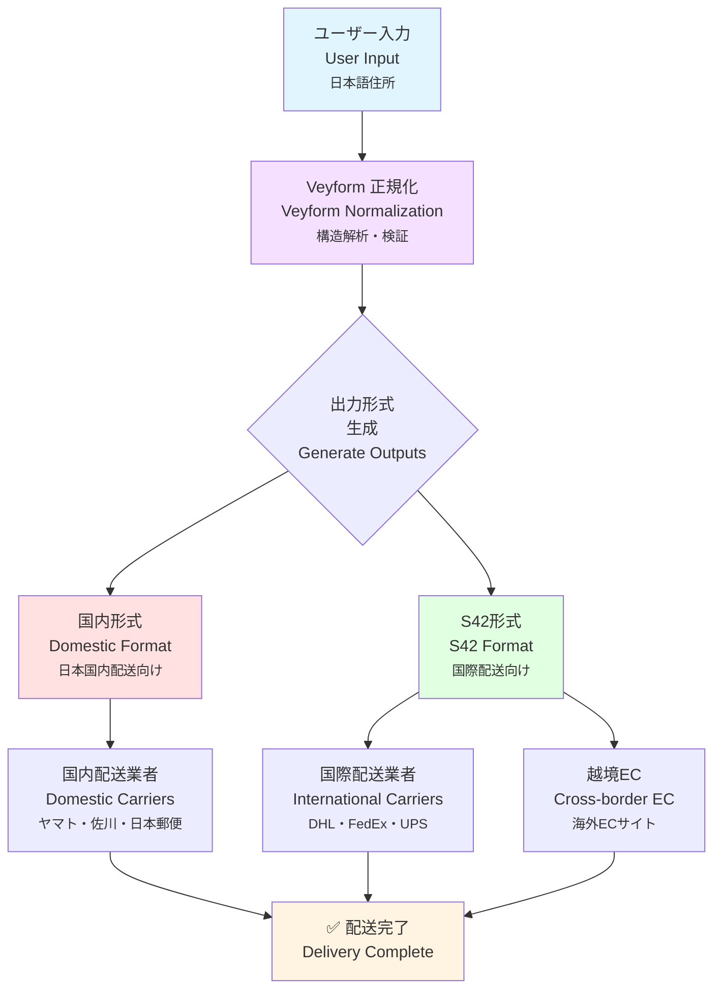
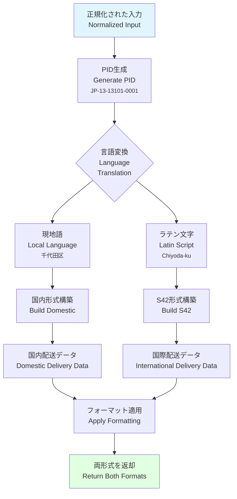
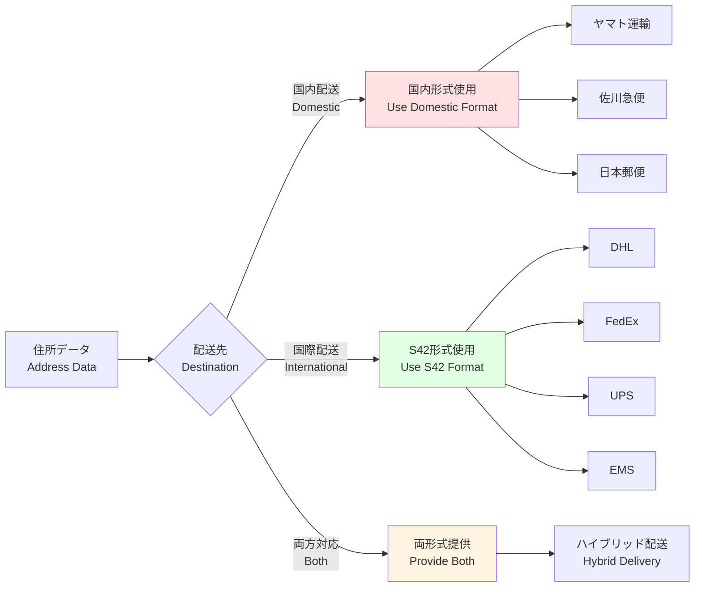
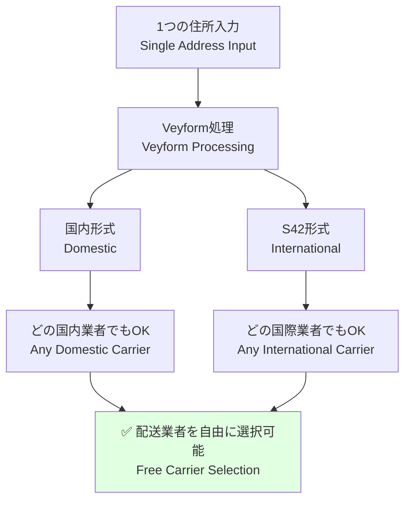

# 国内形式とS42 (国際形式) の二重出力図 / Dual Output: Domestic and S42 International Format

このドキュメントは、1つの入力から国内形式とS42国際形式の2つの出力が生成されることを説明します。これにより、配送業者に依存せずに国際配送が可能になります。

This document explains how a single input generates two outputs: domestic format and S42 international format. This enables international delivery without dependency on specific carriers.

---

## 🎯 二重出力の概要 / Dual Output Overview



---

## 📋 国内形式 / Domestic Format

### 日本の例 / Japanese Example

**ユーザー入力**:
```
郵便番号: 100-0001
都道府県: 東京都
市区町村: 千代田区
町域: 千代田
番地: 1-1
建物名: 千代田ビル 101号室
受取人: 山田太郎
```

**生成される国内形式**:
```json
{
  "domesticFormat": {
    "country": "JP",
    "language": "ja",
    "formatted": "〒100-0001\n東京都千代田区千代田1-1\n千代田ビル 101号室\n山田太郎 様",
    "components": {
      "postalCode": "100-0001",
      "prefecture": "東京都",
      "city": "千代田区",
      "town": "千代田",
      "streetAddress": "1-1",
      "building": "千代田ビル 101号室",
      "recipient": "山田太郎"
    },
    "deliveryInstructions": {
      "carrier": "domestic",
      "format": "japanese_standard",
      "printable": true
    }
  }
}
```

**印刷用フォーマット** (配送伝票):
```
━━━━━━━━━━━━━━━━━━━━━━━━
〒100-0001
東京都千代田区千代田1-1
千代田ビル 101号室

山田太郎 様
━━━━━━━━━━━━━━━━━━━━━━━━
```

---

## 🌍 S42形式 (国際形式) / S42 Format (International Format)

### S42形式の特徴 / S42 Format Features

**S42** = **S**tandardized **42** fields for global addressing

- **標準化された42フィールド**: 世界中の住所に対応
- **ISO準拠**: ISO 3166-1/2に準拠した国・地域コード
- **多言語対応**: 現地語とラテン文字の併記
- **配送業者非依存**: どの国際配送業者でも利用可能

### 日本の例 / Japanese Example

**同じ入力から生成されるS42形式**:
```json
{
  "s42Format": {
    "version": "1.0",
    "country": {
      "iso2": "JP",
      "iso3": "JPN",
      "name": "Japan",
      "nameLocal": "日本"
    },
    "recipient": {
      "name": "Taro Yamada",
      "nameLocal": "山田太郎",
      "honorific": "Mr."
    },
    "address": {
      "level1": {
        "code": "13",
        "name": "Tokyo",
        "nameLocal": "東京都",
        "type": "Prefecture"
      },
      "level2": {
        "code": "13101",
        "name": "Chiyoda-ku",
        "nameLocal": "千代田区",
        "type": "Ward"
      },
      "level3": {
        "name": "Chiyoda",
        "nameLocal": "千代田",
        "type": "Town"
      },
      "streetAddress": "1-1",
      "building": {
        "name": "Chiyoda Building",
        "nameLocal": "千代田ビル",
        "room": "101"
      }
    },
    "postal": {
      "code": "100-0001",
      "format": "###-####"
    },
    "coordinates": {
      "latitude": 35.6895,
      "longitude": 139.6917
    },
    "pid": "JP-13-13101-0001",
    "deliveryInstructions": {
      "carrier": "international",
      "format": "s42_standard",
      "language": "en"
    }
  }
}
```

**印刷用フォーマット** (国際配送ラベル):
```
━━━━━━━━━━━━━━━━━━━━━━━━
Mr. Taro Yamada
Chiyoda Building Room 101
1-1 Chiyoda
Chiyoda-ku, Tokyo 100-0001
JAPAN

〒100-0001
東京都千代田区千代田1-1
千代田ビル 101号室
山田太郎 様
━━━━━━━━━━━━━━━━━━━━━━━━
```

---

## 🔄 変換プロセス / Conversion Process



---

## 📊 フィールドマッピング / Field Mapping

### 国内形式 ↔ S42形式の対応 / Domestic ↔ S42 Mapping

| 国内形式 (日本) | S42フィールド | 例 |
|---------------|-------------|-----|
| 郵便番号 | `postal.code` | 100-0001 |
| 都道府県 | `address.level1` | Tokyo (東京都) |
| 市区町村 | `address.level2` | Chiyoda-ku (千代田区) |
| 町域 | `address.level3` | Chiyoda (千代田) |
| 番地 | `address.streetAddress` | 1-1 |
| 建物名 | `address.building.name` | Chiyoda Building (千代田ビル) |
| 部屋番号 | `address.building.room` | 101 |
| 受取人 | `recipient.name` | Taro Yamada (山田太郎) |
| - | `coordinates` | (35.6895, 139.6917) |
| - | `pid` | JP-13-13101-0001 |

---

## 🌐 国別の二重出力例 / Country-specific Dual Output Examples

### 🇺🇸 アメリカの例 / US Example

**ユーザー入力**:
```
Street Address: 123 Main Street
Apartment: Apt 4B
City: New York
State: NY
ZIP Code: 10001
Recipient: John Smith
```

**国内形式**:
```
John Smith
123 Main Street, Apt 4B
New York, NY 10001
United States
```

**S42形式**:
```json
{
  "country": { "iso2": "US", "name": "United States" },
  "recipient": { "name": "John Smith" },
  "address": {
    "streetAddress": "123 Main Street",
    "apartment": "Apt 4B",
    "level2": { "name": "New York", "type": "City" },
    "level1": { "code": "NY", "name": "New York", "type": "State" }
  },
  "postal": { "code": "10001" },
  "pid": "US-NY-NYC-10001"
}
```

---

### 🇨🇳 中国の例 / China Example

**ユーザー入力**:
```
郵便番号: 100000
省: 北京市
市: 北京市
区: 東城区
街道: 王府井大街
詳細住所: 138号 金融街购物中心
受取人: 张伟
```

**国内形式**:
```
100000
北京市 東城区
王府井大街138号
金融街购物中心
张伟 先生 收
```

**S42形式**:
```json
{
  "country": { "iso2": "CN", "name": "China", "nameLocal": "中国" },
  "recipient": { "name": "Zhang Wei", "nameLocal": "张伟" },
  "address": {
    "level1": { "name": "Beijing", "nameLocal": "北京市", "type": "Municipality" },
    "level2": { "name": "Dongcheng", "nameLocal": "東城区", "type": "District" },
    "streetAddress": "138 Wangfujing Street",
    "streetAddressLocal": "王府井大街138号",
    "building": { "name": "Financial Street Shopping Center", "nameLocal": "金融街购物中心" }
  },
  "postal": { "code": "100000" },
  "pid": "CN-11-110101"
}
```

---

## 🚚 配送業者別の使い分け / Usage by Carrier Type



### 国内配送業者 / Domestic Carriers

**要求形式**: 国内形式 (現地語)

```javascript
// 国内配送業者への送信例
const domesticShipment = {
  carrier: 'yamato',
  address: result.domesticFormat.formatted,
  components: result.domesticFormat.components
};

// ヤマト運輸の伝票に印刷
printLabel(domesticShipment);
```

### 国際配送業者 / International Carriers

**要求形式**: S42形式 (英語 + 現地語)

```javascript
// 国際配送業者への送信例
const internationalShipment = {
  carrier: 'dhl',
  address: result.s42Format,
  // S42形式なので自動的に対応可能
  tracking: true,
  insurance: true
};

// DHLのシステムに送信
sendToDHL(internationalShipment);
```

---

## 🎨 出力のカスタマイズ / Output Customization

### フォーマットオプション / Format Options

```javascript
import { Veyform } from '@vey/veyform-core';

const veyform = new Veyform({
  country: 'JP',
  outputFormats: {
    // 国内形式のカスタマイズ
    domestic: {
      language: 'ja',               // 日本語
      includeHonorific: true,       // 敬称を含める
      format: 'japanese_standard',  // 標準フォーマット
      lineBreaks: '\n'              // 改行コード
    },
    
    // S42形式のカスタマイズ
    s42: {
      version: '1.0',
      includeCoordinates: true,     // 座標を含める
      includePID: true,             // PIDを含める
      romanization: 'hepburn',      // ローマ字方式
      languagePrimary: 'en',        // 主言語
      languageSecondary: 'ja'       // 副言語
    }
  }
});

// 住所を処理
const result = await veyform.processAddress(userInput);

console.log(result.domesticFormat);
console.log(result.s42Format);
```

---

## 🔍 二重出力の利点 / Advantages of Dual Output

### 1. 配送業者非依存 / Carrier Independence



### 2. 国際配送の簡素化 / Simplified International Delivery

**従来の方法**:
```
❌ 国別に異なるフォーマット
❌ 配送業者ごとに異なるAPI
❌ 住所の翻訳が必要
❌ エラー率が高い
```

**Veyform + S42**:
```
✅ 統一されたS42フォーマット
✅ どの配送業者でも使える
✅ 自動的に翻訳済み
✅ エラー率が低い
```

### 3. データの再利用性 / Data Reusability

```javascript
// 1回の処理で両方の形式を取得
const result = await veyform.processAddress(input);

// 国内配送に使用
sendDomesticShipment(result.domesticFormat);

// 国際配送にも使用可能
sendInternationalShipment(result.s42Format);

// 別のシステムにも連携可能
saveToDatabase({
  domestic: result.domesticFormat,
  international: result.s42Format
});
```

---

## 📦 実装例 / Implementation Examples

### React Component

```tsx
import { VeyformAddressForm } from '@vey/veyform-react';
import { useState } from 'react';

function ShippingForm() {
  const [addressData, setAddressData] = useState(null);
  
  const handleSubmit = (result) => {
    setAddressData(result);
    
    // 国内配送の場合
    if (isdomesticDelivery) {
      submitToCarrier(result.domesticFormat);
    }
    
    // 国際配送の場合
    if (isInternationalDelivery) {
      submitToCarrier(result.s42Format);
    }
  };
  
  return (
    <div>
      <VeyformAddressForm
        country="JP"
        outputFormats={['domestic', 's42']}
        onSubmit={handleSubmit}
      />
      
      {addressData && (
        <div>
          <h3>国内形式</h3>
          <pre>{addressData.domesticFormat.formatted}</pre>
          
          <h3>S42形式</h3>
          <pre>{JSON.stringify(addressData.s42Format, null, 2)}</pre>
        </div>
      )}
    </div>
  );
}
```

### Node.js Backend

```javascript
const { Veyform } = require('@vey/veyform-core');

async function processShippingAddress(userInput) {
  const veyform = new Veyform({ country: userInput.country });
  
  // 住所を処理して両形式を取得
  const result = await veyform.processAddress(userInput);
  
  // データベースに保存
  await db.addresses.create({
    userId: userInput.userId,
    domesticFormat: result.domesticFormat,
    s42Format: result.s42Format,
    pid: result.pid
  });
  
  // 配送業者に送信
  if (isInternational) {
    await sendToDHL({
      address: result.s42Format,
      tracking: true
    });
  } else {
    await sendToYamato({
      address: result.domesticFormat
    });
  }
  
  return result;
}
```

---

## 🌍 S42の国際標準化 / S42 International Standardization

### ISO準拠 / ISO Compliance

S42形式はISO標準に準拠:
- **ISO 3166-1**: 国コード (alpha-2, alpha-3, numeric)
- **ISO 3166-2**: 地域コード (都道府県、州など)
- **ISO 639**: 言語コード
- **WGS84**: 座標系

### グローバル対応 / Global Coverage

```javascript
// 全269カ国・地域に対応
const supportedCountries = [
  'JP', 'US', 'GB', 'CN', 'KR', 'FR', 'DE', 'IT', 'ES', 'CA',
  // ... 259 more countries
];

// どの国でも同じS42形式で出力
const jpAddress = await veyform.processAddress({ country: 'JP', ... });
const usAddress = await veyform.processAddress({ country: 'US', ... });
const cnAddress = await veyform.processAddress({ country: 'CN', ... });

// すべてS42形式で統一
console.log(jpAddress.s42Format);
console.log(usAddress.s42Format);
console.log(cnAddress.s42Format);
```

---

## 📈 パフォーマンス / Performance

### 変換速度 / Conversion Speed

| 処理 | 時間 | 備考 |
|------|------|------|
| 国内形式生成 | <10ms | ローカル処理 |
| S42形式生成 | <20ms | 翻訳含む |
| PID生成 | <5ms | ハッシュ計算 |
| 座標取得 | <100ms | ジオコーディング (オプション) |
| **合計** | **<150ms** | **すべて含む** |

---

## 関連ドキュメント / Related Documents

- [住所処理パイプライン](./01-address-processing-pipeline.md)
- [国別住所階層マップ](./02-country-address-hierarchy.md)
- [PID階層ツリー](./07-pid-hierarchical-tree.md)
- [S42 Format Specification](../../../docs/s42-format-spec.md)
