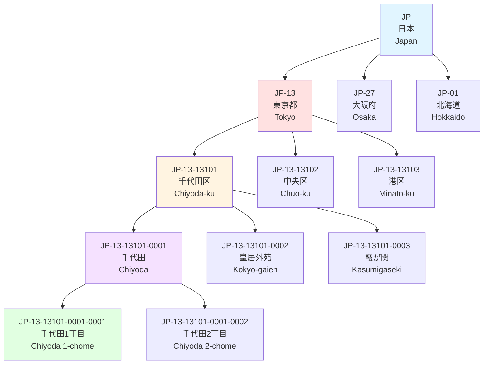
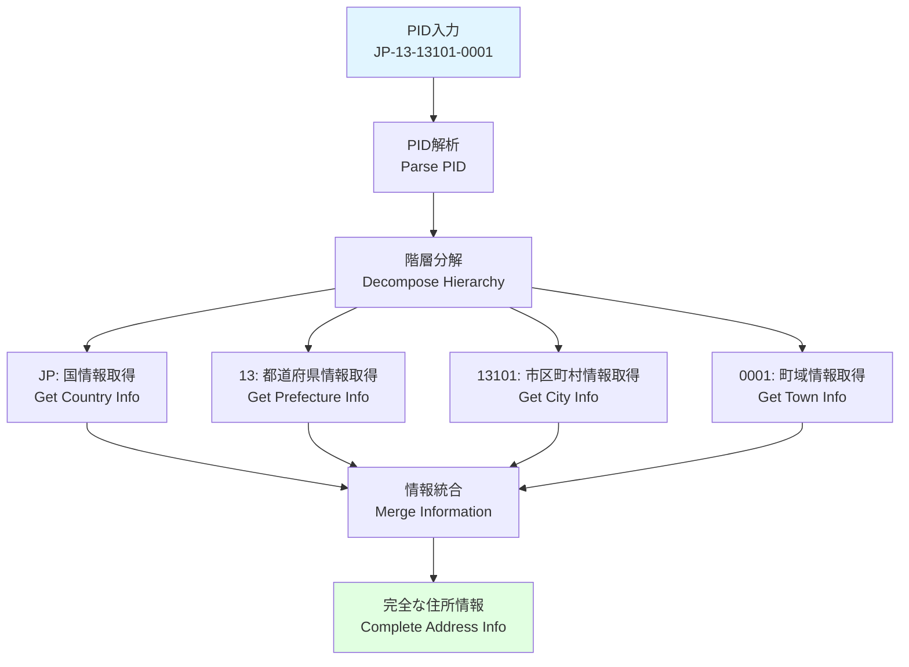
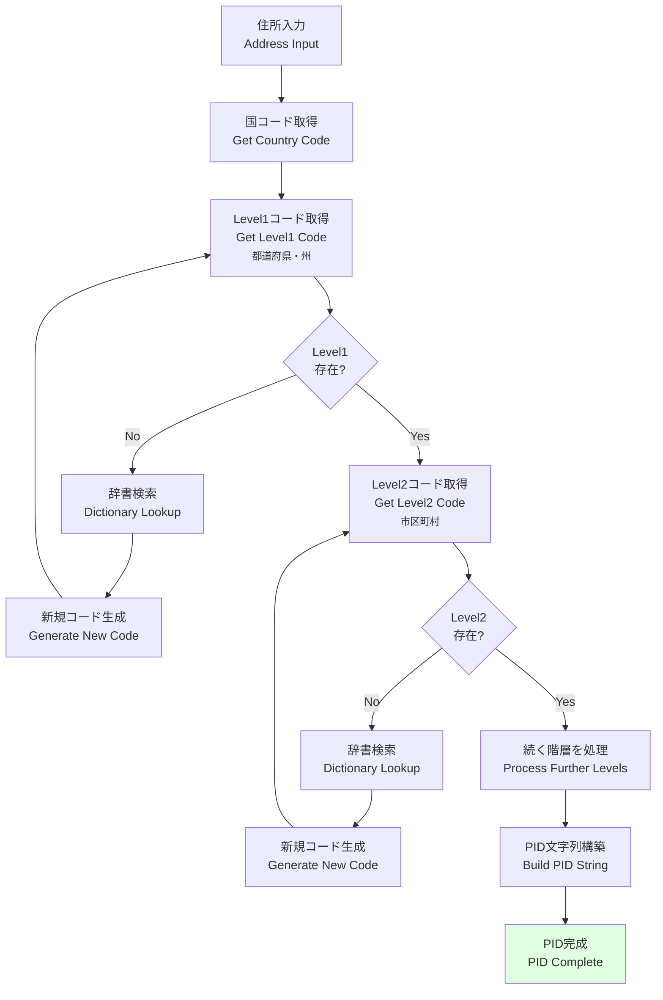

# PID (Place ID) 階層ツリー図 / PID Hierarchical Tree Diagram

このドキュメントは、PID (Place ID) の階層的な構造を説明します。PIDは国境を超えて住所階層を統一的に扱うための識別子システムです。

This document explains the hierarchical structure of PID (Place ID). PID is an identifier system for handling address hierarchies uniformly across borders.

---

## 🎯 PID概要 / PID Overview

**PID (Place ID)** = 場所の階層的識別子

- **グローバル一意性**: 世界中でユニークなID
- **階層構造**: 親子関係を明示
- **可読性**: 人間が読める形式
- **拡張性**: 新しい地域の追加が容易

### PID構造 / PID Structure

```
{CountryCode}-{Level1}-{Level2}-{Level3}-{Level4}
    ↓           ↓        ↓        ↓        ↓
   国コード    都道府県    市区町村   町域     小地域
```

---

## 🌳 日本のPIDツリー例 / Japanese PID Tree Example



---

## 📋 PIDの階層レベル / PID Hierarchy Levels

### レベル0: 国 / Level 0: Country

```
PID: JP
名前: 日本 (Japan)
ISO: JP (alpha-2), JPN (alpha-3), 392 (numeric)
タイプ: Country
```

### レベル1: 都道府県/州 / Level 1: Prefecture/State

```
PID: JP-13
名前: 東京都 (Tokyo)
コード: 13
タイプ: Prefecture
親: JP
```

**日本の全47都道府県**:
```
JP-01: 北海道 (Hokkaido)
JP-02: 青森県 (Aomori)
JP-03: 岩手県 (Iwate)
...
JP-13: 東京都 (Tokyo)
...
JP-47: 沖縄県 (Okinawa)
```

### レベル2: 市区町村 / Level 2: City/Ward

```
PID: JP-13-13101
名前: 千代田区 (Chiyoda-ku)
コード: 13101
タイプ: Special Ward (特別区)
親: JP-13
```

**東京都の特別区**:
```
JP-13-13101: 千代田区 (Chiyoda-ku)
JP-13-13102: 中央区 (Chuo-ku)
JP-13-13103: 港区 (Minato-ku)
JP-13-13104: 新宿区 (Shinjuku-ku)
...
JP-13-13123: 江戸川区 (Edogawa-ku)
```

### レベル3: 町域 / Level 3: Town

```
PID: JP-13-13101-0001
名前: 千代田 (Chiyoda)
コード: 0001
タイプ: Town
親: JP-13-13101
郵便番号: 100-0001
```

**千代田区の町域**:
```
JP-13-13101-0001: 千代田 (Chiyoda)
JP-13-13101-0002: 皇居外苑 (Kokyo-gaien)
JP-13-13101-0003: 霞が関 (Kasumigaseki)
JP-13-13101-0004: 永田町 (Nagatacho)
...
```

### レベル4: 小地域・丁目 / Level 4: Sub-area/Chome

```
PID: JP-13-13101-0001-0001
名前: 千代田1丁目 (Chiyoda 1-chome)
コード: 0001
タイプ: Chome
親: JP-13-13101-0001
```

---

## 🌍 国別PID構造の比較 / Country-specific PID Structure Comparison

### 🇯🇵 日本 (Japan)

```
JP-13-13101-0001-0001
│  │  │     │    └─ 丁目 (Chome)
│  │  │     └────── 町域 (Town)
│  │  └──────────── 市区町村 (City/Ward)
│  └───────────────── 都道府県 (Prefecture)
└──────────────────── 国 (Country)
```

**完全な例**:
```json
{
  "pid": "JP-13-13101-0001-0001",
  "hierarchy": {
    "country": {
      "code": "JP",
      "name": "Japan",
      "nameLocal": "日本"
    },
    "level1": {
      "code": "13",
      "name": "Tokyo",
      "nameLocal": "東京都",
      "type": "Prefecture"
    },
    "level2": {
      "code": "13101",
      "name": "Chiyoda-ku",
      "nameLocal": "千代田区",
      "type": "SpecialWard"
    },
    "level3": {
      "code": "0001",
      "name": "Chiyoda",
      "nameLocal": "千代田",
      "type": "Town"
    },
    "level4": {
      "code": "0001",
      "name": "Chiyoda 1-chome",
      "nameLocal": "千代田1丁目",
      "type": "Chome"
    }
  }
}
```

---

### 🇺🇸 アメリカ (United States)

```
US-NY-NYC-10001
│  │  │   └─ ZIP Code
│  │  └───── City Code
│  └──────── State Code
└─────────── Country Code
```

**例**:
```json
{
  "pid": "US-NY-NYC-10001",
  "hierarchy": {
    "country": {
      "code": "US",
      "name": "United States"
    },
    "level1": {
      "code": "NY",
      "name": "New York",
      "type": "State"
    },
    "level2": {
      "code": "NYC",
      "name": "New York City",
      "type": "City"
    },
    "level3": {
      "code": "10001",
      "name": "Manhattan - Chelsea",
      "type": "ZIP"
    }
  }
}
```

---

### 🇨🇳 中国 (China)

```
CN-11-110101
│  │  └────── 区コード (District)
│  └─────────── 市コード (City)
└────────────── 省コード (Province)
```

**例**:
```json
{
  "pid": "CN-11-110101",
  "hierarchy": {
    "country": {
      "code": "CN",
      "name": "China",
      "nameLocal": "中国"
    },
    "level1": {
      "code": "11",
      "name": "Beijing",
      "nameLocal": "北京市",
      "type": "Municipality"
    },
    "level2": {
      "code": "110100",
      "name": "Beijing",
      "nameLocal": "北京市",
      "type": "City"
    },
    "level3": {
      "code": "110101",
      "name": "Dongcheng",
      "nameLocal": "東城区",
      "type": "District"
    }
  }
}
```

---

### 🇬🇧 イギリス (United Kingdom)

```
GB-ENG-LDN-SW1A
│  │   │   └─ Postcode Area
│  │   └───── City
│  └─────────── Region
└───────────── Country
```

**例**:
```json
{
  "pid": "GB-ENG-LDN-SW1A",
  "hierarchy": {
    "country": {
      "code": "GB",
      "name": "United Kingdom"
    },
    "level1": {
      "code": "ENG",
      "name": "England",
      "type": "Country"
    },
    "level2": {
      "code": "LDN",
      "name": "London",
      "type": "City"
    },
    "level3": {
      "code": "SW1A",
      "name": "Westminster",
      "type": "PostcodeArea"
    }
  }
}
```

---

## 🔍 PIDの検索と解決 / PID Lookup and Resolution

### PIDからの情報取得 / Information Retrieval from PID



### 実装例 / Implementation Example

```javascript
import { resolvePID } from '@vey/veyform-core';

// PIDから完全な住所情報を取得
const addressInfo = await resolvePID('JP-13-13101-0001');

console.log(addressInfo);
/*
{
  pid: 'JP-13-13101-0001',
  formatted: {
    ja: '東京都千代田区千代田',
    en: 'Chiyoda, Chiyoda-ku, Tokyo, Japan'
  },
  hierarchy: {
    country: { code: 'JP', name: 'Japan', nameLocal: '日本' },
    prefecture: { code: '13', name: 'Tokyo', nameLocal: '東京都' },
    city: { code: '13101', name: 'Chiyoda-ku', nameLocal: '千代田区' },
    town: { code: '0001', name: 'Chiyoda', nameLocal: '千代田' }
  },
  postalCode: '100-0001',
  coordinates: {
    latitude: 35.6895,
    longitude: 139.6917
  },
  timezone: 'Asia/Tokyo',
  population: 5200
}
*/
```

---

## 🔗 PIDの活用シーン / PID Use Cases

### 1. 住所の一意識別 / Unique Address Identification

```javascript
// 同じ住所を異なる表記で入力しても、同じPIDに解決される
const address1 = {
  prefecture: '東京都',
  city: '千代田区',
  town: '千代田'
};

const address2 = {
  prefecture: 'Tokyo',
  city: 'Chiyoda-ku',
  town: 'Chiyoda'
};

const pid1 = await generatePID(address1);
const pid2 = await generatePID(address2);

console.log(pid1 === pid2); // true: 'JP-13-13101-0001'
```

### 2. 階層的な地域検索 / Hierarchical Region Search

```javascript
// 特定の都道府県内のすべての市区町村を取得
const cities = await findByPIDPrefix('JP-13-');
/*
[
  'JP-13-13101', // 千代田区
  'JP-13-13102', // 中央区
  'JP-13-13103', // 港区
  ...
]
*/

// 特定の市区町村内のすべての町域を取得
const towns = await findByPIDPrefix('JP-13-13101-');
/*
[
  'JP-13-13101-0001', // 千代田
  'JP-13-13101-0002', // 皇居外苑
  'JP-13-13101-0003', // 霞が関
  ...
]
*/
```

### 3. 地域統計の集計 / Regional Statistics Aggregation

```javascript
// PIDベースで統計を集計
const stats = await getStatsByPID('JP-13-13101');
/*
{
  pid: 'JP-13-13101',
  name: 'Chiyoda-ku',
  totalAddresses: 125000,
  totalPopulation: 66680,
  area: 11.66, // km²
  postalCodes: ['100-0001', '100-0002', ...],
  subregions: 11
}
*/
```

### 4. 配送エリアの定義 / Delivery Area Definition

```javascript
// 配送可能エリアをPIDで定義
const deliveryZone = {
  name: '東京23区配送エリア',
  pids: [
    'JP-13-13101', // 千代田区
    'JP-13-13102', // 中央区
    'JP-13-13103', // 港区
    // ... 他の特別区
  ],
  deliveryFee: 500,
  estimatedDays: 1
};

// 住所がエリア内かチェック
function isInDeliveryZone(addressPID) {
  return deliveryZone.pids.some(zonePID => 
    addressPID.startsWith(zonePID)
  );
}

console.log(isInDeliveryZone('JP-13-13101-0001')); // true (千代田区)
console.log(isInDeliveryZone('JP-27-27128')); // false (大阪市)
```

---

## 🌐 PIDのグローバル統一性 / Global Uniformity of PID

### 統一されたクエリ / Unified Queries

```javascript
// すべての国で同じAPIを使用
const jp = await resolvePID('JP-13-13101-0001');
const us = await resolvePID('US-NY-NYC-10001');
const cn = await resolvePID('CN-11-110101');
const gb = await resolvePID('GB-ENG-LDN-SW1A');

// すべて同じ構造で返却される
console.log(jp.hierarchy);
console.log(us.hierarchy);
console.log(cn.hierarchy);
console.log(gb.hierarchy);
```

### 国境を超えた比較 / Cross-border Comparison

```javascript
// 複数の国の地域を比較
const regions = await Promise.all([
  resolvePID('JP-13'),      // 東京都
  resolvePID('US-NY'),      // ニューヨーク州
  resolvePID('GB-ENG-LDN'), // ロンドン
  resolvePID('CN-11')       // 北京市
]);

// 人口順にソート
const sorted = regions.sort((a, b) => 
  b.population - a.population
);

console.log(sorted.map(r => ({
  name: r.name,
  population: r.population
})));
```

---

## 🔧 PID生成アルゴリズム / PID Generation Algorithm

### 基本的な生成フロー / Basic Generation Flow



### コード例 / Code Example

```typescript
async function generatePID(address: AddressInput): Promise<string> {
  const parts: string[] = [];
  
  // Level 0: 国コード
  parts.push(address.country);
  
  // Level 1: 都道府県・州
  if (address.prefecture || address.state) {
    const level1Code = await getLevel1Code(
      address.country,
      address.prefecture || address.state
    );
    parts.push(level1Code);
  }
  
  // Level 2: 市区町村
  if (address.city) {
    const level2Code = await getLevel2Code(
      address.country,
      parts[1], // Level1 code
      address.city
    );
    parts.push(level2Code);
  }
  
  // Level 3: 町域
  if (address.town) {
    const level3Code = await getLevel3Code(
      address.country,
      parts[2], // Level2 code
      address.town
    );
    parts.push(level3Code);
  }
  
  // Level 4: 小地域
  if (address.subarea) {
    const level4Code = await getLevel4Code(
      address.country,
      parts[3], // Level3 code
      address.subarea
    );
    parts.push(level4Code);
  }
  
  return parts.join('-');
}

// 使用例
const pid = await generatePID({
  country: 'JP',
  prefecture: '東京都',
  city: '千代田区',
  town: '千代田'
});

console.log(pid); // 'JP-13-13101-0001'
```

---

## 📊 PIDデータベース / PID Database

### データ構造 / Data Structure

```javascript
// PIDデータベースのスキーマ
const pidDatabase = {
  'JP-13-13101-0001': {
    pid: 'JP-13-13101-0001',
    level: 3,
    type: 'town',
    parent: 'JP-13-13101',
    children: [
      'JP-13-13101-0001-0001',
      'JP-13-13101-0001-0002'
    ],
    name: {
      local: '千代田',
      roman: 'Chiyoda',
      en: 'Chiyoda'
    },
    postalCodes: ['100-0001'],
    coordinates: {
      latitude: 35.6895,
      longitude: 139.6917
    },
    metadata: {
      population: 5200,
      area: 1.15, // km²
      timezone: 'Asia/Tokyo'
    }
  }
};
```

### インデックス構造 / Index Structure

```javascript
// 高速検索のためのインデックス
const indexes = {
  // PIDで検索
  byPID: Map<string, PlaceData>,
  
  // 名前で検索 (複数言語)
  byName: {
    local: Map<string, string[]>, // name -> [pid, pid, ...]
    roman: Map<string, string[]>,
    en: Map<string, string[]>
  },
  
  // 郵便番号で検索
  byPostalCode: Map<string, string[]>, // postalCode -> [pid, pid, ...]
  
  // 親子関係で検索
  byParent: Map<string, string[]>, // parentPID -> [childPID, ...]
  
  // 座標で検索 (geohash)
  byCoordinates: GeoIndex
};
```

---

## 関連ドキュメント / Related Documents

- [国別住所階層マップ](./02-country-address-hierarchy.md)
- [国内形式とS42出力](./06-dual-output-format.md)
- [住所処理パイプライン](./01-address-processing-pipeline.md)
- [PID API Documentation](../../../docs/api/pid-api.md)
