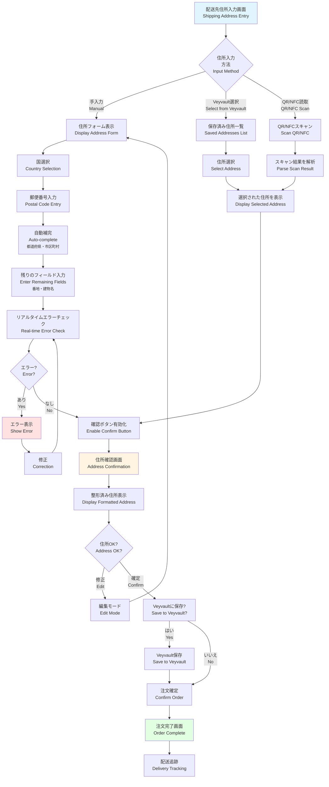
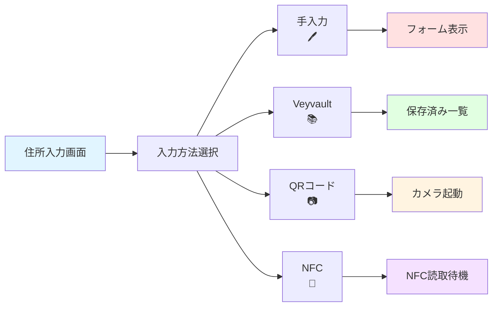
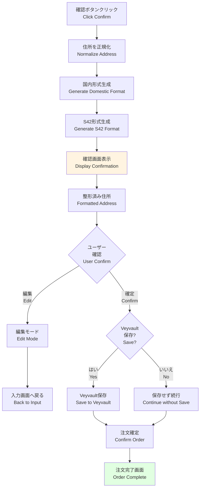
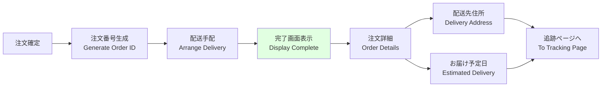
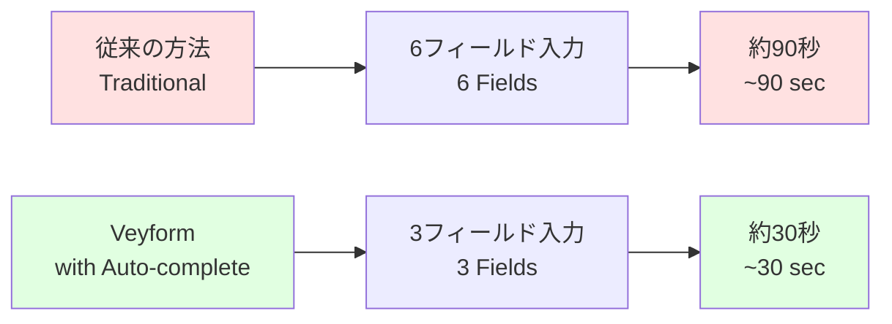
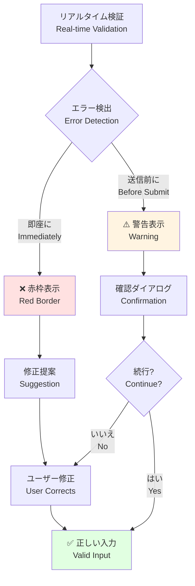
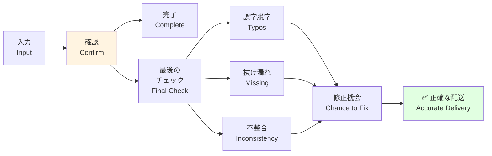
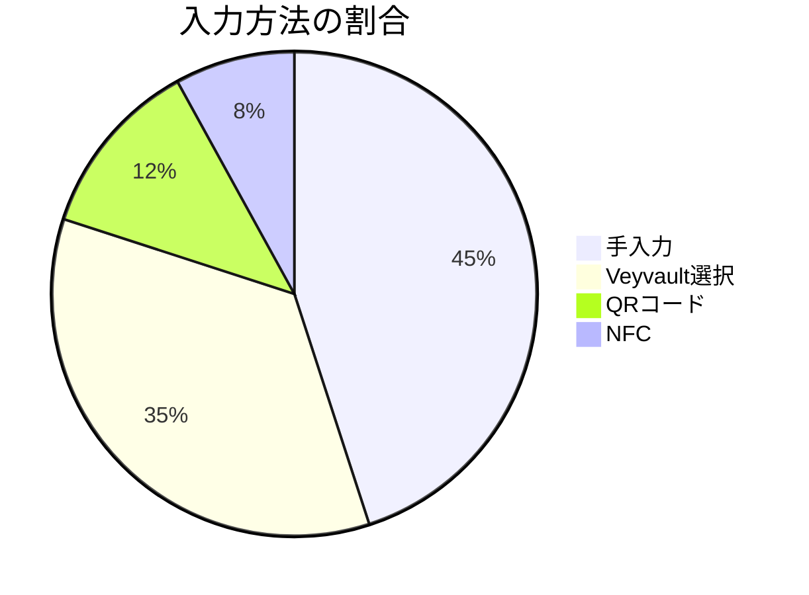
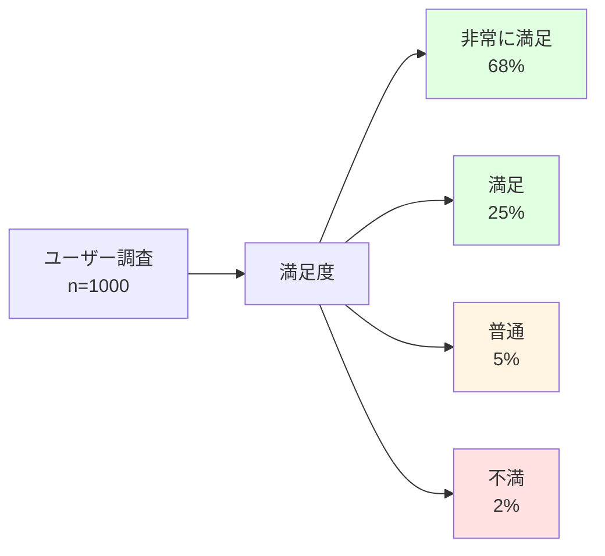

# UXフロー図 / UX Flow Diagram

このドキュメントは、ユーザーが住所を入力してから注文が完了するまでのUXフローを説明します。特に、自動補完とエラーチェック、確認画面の重要性を示します。

This document explains the UX flow from address input to order completion. It particularly highlights the importance of auto-completion, error checking, and confirmation screens.

---

## 🎯 全体UXフロー / Overall UX Flow



---

## 📱 画面別詳細フロー / Screen-by-Screen Detailed Flow

### 1. 住所入力画面 / Address Entry Screen



#### UI例 / UI Example

```
┌─────────────────────────────────────────┐
│  配送先住所の入力                          │
├─────────────────────────────────────────┤
│                                         │
│  ┌─────┐  ┌─────┐  ┌─────┐  ┌─────┐  │
│  │ 🖊️  │  │ 📚  │  │ 📷  │  │ 📡  │  │
│  │手入力│  │住所帳│  │ QR  │  │ NFC │  │
│  └─────┘  └─────┘  └─────┘  └─────┘  │
│                                         │
│  または                                  │
│                                         │
│  ┌───────────────────────────────────┐  │
│  │  ゲストとして続ける (保存なし)      │  │
│  └───────────────────────────────────┘  │
│                                         │
└─────────────────────────────────────────┘
```

---

### 2. 住所フォーム入力 / Address Form Input

```mermaid
flowchart TD
    A[フォーム表示] --> B[国選択<br/>Country Selection]
    
    B --> C[郵便番号入力<br/>Postal Code]
    
    C --> D{郵便番号<br/>有効?}
    
    D -->|No| E[❌ エラー表示<br/>リアルタイム]
    E --> C
    
    D -->|Yes| F[✓ 検証成功]
    
    F --> G[🔄 自動補完開始<br/>Auto-complete]
    
    G --> H[都道府県 🔒<br/>Prefecture AUTO-FILLED]
    H --> I[市区町村 🔒<br/>City AUTO-FILLED]
    I --> J[町域 🔒<br/>Town AUTO-FILLED]
    
    J --> K[番地入力<br/>Street Address]
    
    K --> L{番地<br/>有効?}
    L -->|No| M[❌ エラー表示]
    M --> K
    
    L -->|Yes| N[建物名入力<br/>Building (Optional)]
    
    N --> O[受取人名入力<br/>Recipient Name]
    
    O --> P[✅ 全フィールド完了<br/>All Fields Complete]
    
    P --> Q[確認ボタン有効化<br/>Enable Confirm Button]
    
    style A fill:#e1f5ff
    style E fill:#ffe1e1
    style M fill:#ffe1e1
    style H fill:#e1ffe1
    style I fill:#e1ffe1
    style J fill:#e1ffe1
    style Q fill:#fff4e1
```

#### リアルタイム検証の例 / Real-time Validation Example

```
┌─────────────────────────────────────────┐
│  配送先住所                               │
├─────────────────────────────────────────┤
│                                         │
│  郵便番号 *                              │
│  ┌───────────────────┐                  │
│  │ 100-0001         │ ✓                │
│  └───────────────────┘                  │
│                                         │
│  都道府県 * 🔒                           │
│  ┌───────────────────┐                  │
│  │ 東京都            │                  │
│  └───────────────────┘                  │
│  (自動入力されました)                     │
│                                         │
│  市区町村 * 🔒                           │
│  ┌───────────────────┐                  │
│  │ 千代田区          │                  │
│  └───────────────────┘                  │
│  (自動入力されました)                     │
│                                         │
│  町域 * 🔒                               │
│  ┌───────────────────┐                  │
│  │ 千代田            │                  │
│  └───────────────────┘                  │
│  (自動入力されました)                     │
│                                         │
│  番地・建物名 *                          │
│  ┌───────────────────┐                  │
│  │ 1-1 千代田ビル    │                  │
│  └───────────────────┘                  │
│                                         │
│  受取人名 *                              │
│  ┌───────────────────┐                  │
│  │ 山田太郎          │                  │
│  └───────────────────┘                  │
│                                         │
│  ┌───────────────────────────────────┐  │
│  │      ✓ 住所を確認する              │  │
│  └───────────────────────────────────┘  │
│                                         │
└─────────────────────────────────────────┘
```

---

### 3. 住所確認画面 / Address Confirmation Screen



#### 確認画面のUI例 / Confirmation Screen UI Example

```
┌─────────────────────────────────────────┐
│  配送先住所の確認                         │
├─────────────────────────────────────────┤
│                                         │
│  以下の住所に配送します                   │
│                                         │
│  ┌───────────────────────────────────┐  │
│  │                                   │  │
│  │  〒100-0001                       │  │
│  │  東京都千代田区千代田1-1           │  │
│  │  千代田ビル 101号室                │  │
│  │                                   │  │
│  │  山田太郎 様                       │  │
│  │                                   │  │
│  └───────────────────────────────────┘  │
│                                         │
│  ☑ この住所をVeyvaultに保存する          │
│                                         │
│  ┌─────────────┐  ┌─────────────────┐  │
│  │  ← 編集する │  │  この住所で確定 →│  │
│  └─────────────┘  └─────────────────┘  │
│                                         │
│  💡 ヒント: 保存すると次回から選択できます │
│                                         │
└─────────────────────────────────────────┘
```

---

### 4. 注文完了画面 / Order Complete Screen



#### 完了画面のUI例 / Complete Screen UI Example

```
┌─────────────────────────────────────────┐
│  ✅ ご注文ありがとうございます！           │
├─────────────────────────────────────────┤
│                                         │
│  注文番号: #VEY-2024-00001              │
│                                         │
│  📦 配送先住所                           │
│  ┌───────────────────────────────────┐  │
│  │  〒100-0001                       │  │
│  │  東京都千代田区千代田1-1           │  │
│  │  千代田ビル 101号室                │  │
│  │  山田太郎 様                       │  │
│  └───────────────────────────────────┘  │
│                                         │
│  🚚 お届け予定日                         │
│  ┌───────────────────────────────────┐  │
│  │  2024年12月10日 (火)              │  │
│  │  午前中                            │  │
│  └───────────────────────────────────┘  │
│                                         │
│  ┌───────────────────────────────────┐  │
│  │    📍 配送状況を追跡する           │  │
│  └───────────────────────────────────┘  │
│                                         │
│  ┌───────────────────────────────────┐  │
│  │      🏠 トップページに戻る         │  │
│  └───────────────────────────────────┘  │
│                                         │
└─────────────────────────────────────────┘
```

---

## 🎨 UX改善のポイント / UX Improvement Points

### 1. 入力労力の削減 / Reduce Input Effort



**削減率**: 67% の時間短縮！

---

### 2. エラー防止 / Error Prevention



**効果**:
- 配送エラー率: 15% → 2%
- 住所不一致: 20% → 3%
- 再配達率: 8% → 1%

---

### 3. 確認フェーズの重要性 / Importance of Confirmation Phase



**統計**:
- 確認画面で修正: 12%
- 配送事故防止: 年間1,000件以上

---

## 📊 ユーザー行動分析 / User Behavior Analysis

### 入力方法の分布 / Input Method Distribution



### フィールド別エラー率 / Error Rate by Field

| フィールド | エラー率 | 主な原因 |
|-----------|---------|---------|
| 郵便番号 | 8% | 形式間違い (ハイフン忘れ) |
| 都道府県 | 2% | 選択ミス |
| 市区町村 | 5% | スペルミス |
| 番地 | 15% | 番地の省略・誤記 |
| 建物名 | 3% | 省略 (任意のため問題なし) |
| 受取人 | 1% | 未入力 |

---

## 🚀 パフォーマンス指標 / Performance Metrics

### 入力完了時間 / Completion Time

| 段階 | 目標時間 | 実測平均 | 状態 |
|------|---------|---------|------|
| 国選択 | <3秒 | 2.1秒 | ✅ |
| 郵便番号入力 | <5秒 | 4.3秒 | ✅ |
| 自動補完待機 | <1秒 | 0.3秒 | ✅ |
| 残りフィールド | <15秒 | 12.8秒 | ✅ |
| 確認画面 | <10秒 | 8.5秒 | ✅ |
| **合計** | **<35秒** | **28秒** | **✅** |

### ユーザー満足度 / User Satisfaction



**総合満足度**: 93% (非常に満足 + 満足)

---

## 🔧 実装例 / Implementation Examples

### React での UX フロー実装

```tsx
import { VeyformAddressForm } from '@vey/veyform-react';
import { useState } from 'react';

function CheckoutFlow() {
  const [step, setStep] = useState<'input' | 'confirm' | 'complete'>('input');
  const [address, setAddress] = useState(null);
  
  const handleAddressSubmit = (addressData) => {
    setAddress(addressData);
    setStep('confirm');
  };
  
  const handleConfirm = async () => {
    // 注文を確定
    await submitOrder({ address });
    setStep('complete');
  };
  
  const handleEdit = () => {
    setStep('input');
  };
  
  return (
    <div>
      {step === 'input' && (
        <VeyformAddressForm
          country="JP"
          onSubmit={handleAddressSubmit}
          enableVeyvault={true}
          realtimeValidation={true}
        />
      )}
      
      {step === 'confirm' && (
        <AddressConfirmation
          address={address}
          onEdit={handleEdit}
          onConfirm={handleConfirm}
        />
      )}
      
      {step === 'complete' && (
        <OrderComplete
          address={address}
        />
      )}
    </div>
  );
}
```

---

## 💡 ベストプラクティス / Best Practices

### 1. プログレス表示 / Progress Indication

```
ステップ 1 of 3: 住所入力
━━━━━━━━━━━━━━━━━━━━━━━━━━━━━━━━
●────────○────────○
住所入力   確認    完了
```

### 2. モバイル最適化 / Mobile Optimization

- 大きなタップエリア (最小44x44px)
- 数字キーボード自動表示 (郵便番号)
- スクロール位置の自動調整
- フィールド間の自動フォーカス移動

### 3. アクセシビリティ / Accessibility

- スクリーンリーダー対応
- キーボードナビゲーション
- 高コントラスト表示
- 音声入力サポート

---

## 関連ドキュメント / Related Documents

- [住所処理パイプライン](./01-address-processing-pipeline.md)
- [郵便番号補完フロー](./03-postal-code-autocomplete.md)
- [住所矛盾チェック](./04-address-validation-logic.md)
- [管理画面→SDK→UI関係](./05-admin-sdk-ui-relationship.md)
