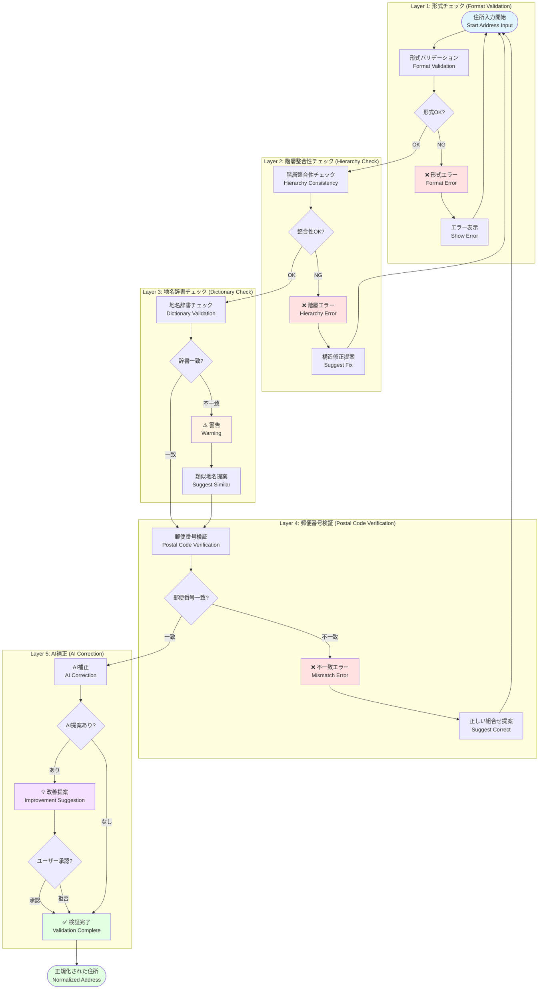
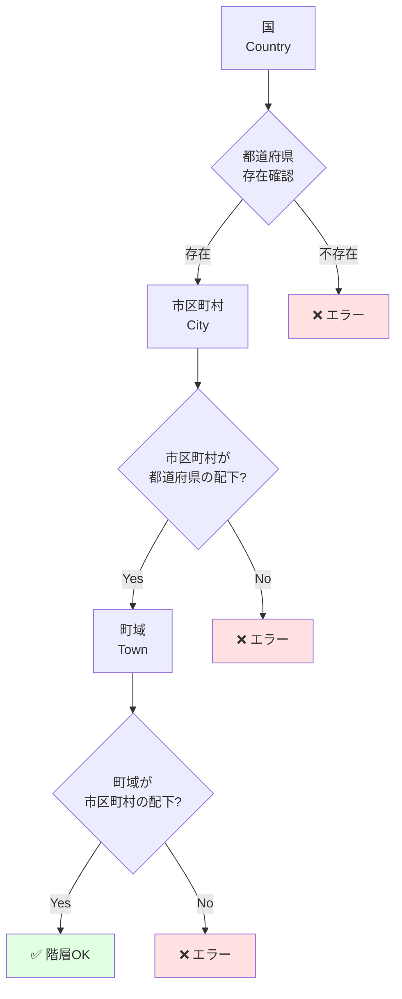
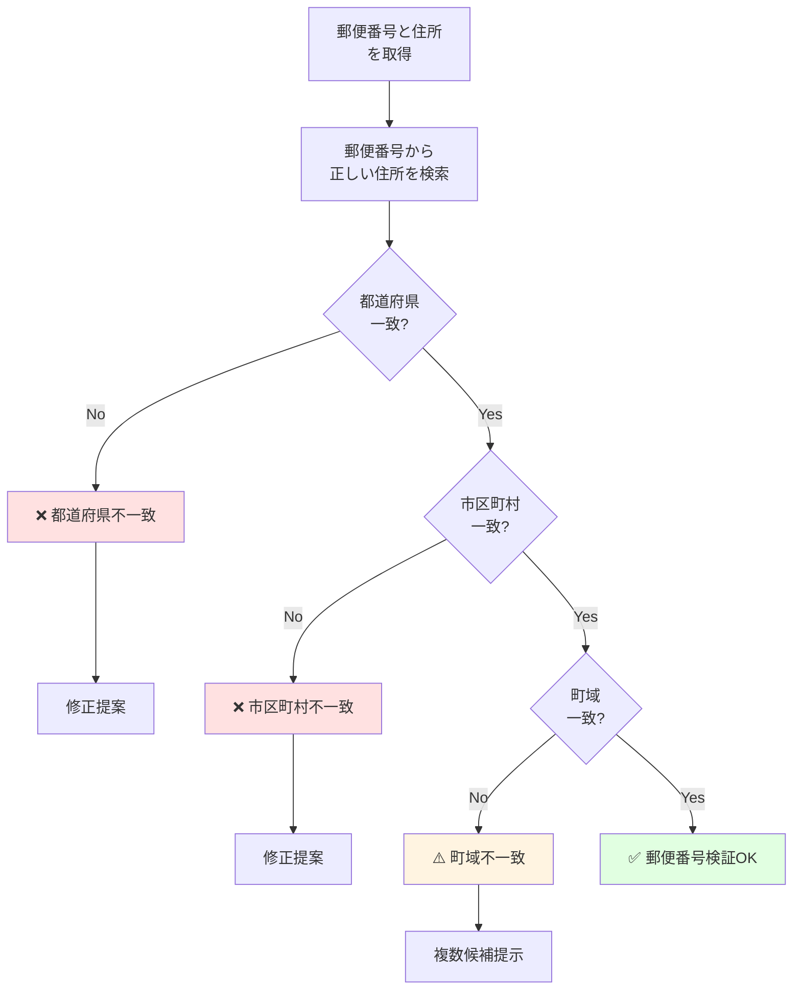
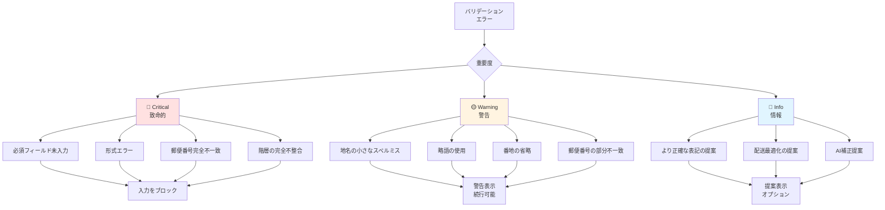
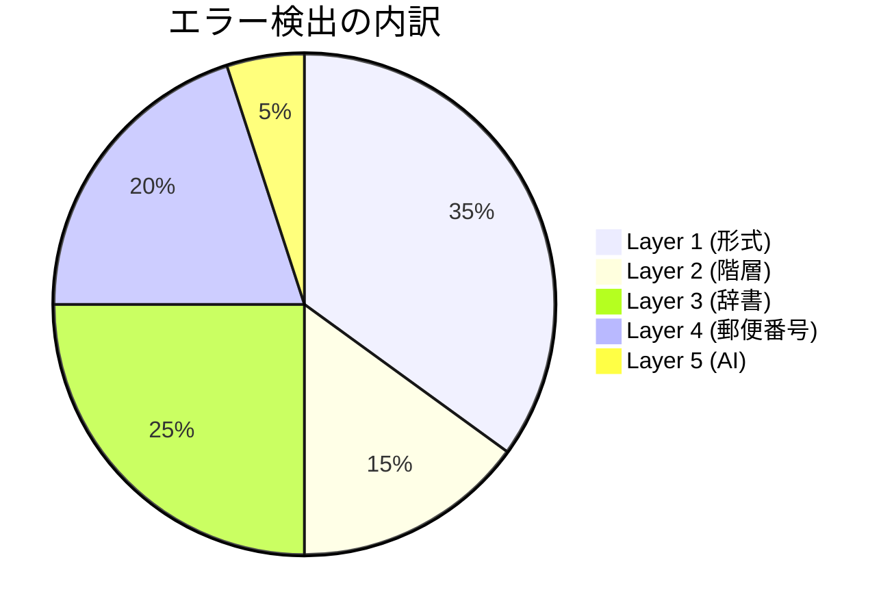
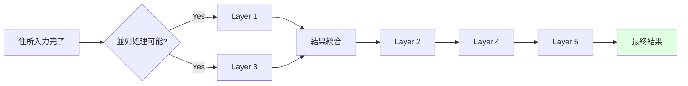

# Validation多層図 / Multi-Layer Validation Diagram

このドキュメントは、Veyformのバリデーションシステムの全5層を詳細に説明します。各層がどの順序で動作するかを可視化し、配送レベルの品質を保証する仕組みを示します。

This document details all 5 layers of Veyform's validation system. It visualizes the order in which each layer operates and demonstrates the mechanism that ensures delivery-level quality.

---

## 🎯 バリデーション多層アーキテクチャ / Multi-Layer Validation Architecture



---

## 📋 各レイヤーの詳細 / Layer Details

### Layer 1: 形式チェック / Format Validation

**目的**: 入力値の基本的な形式妥当性を即座に検証

**処理タイミング**: リアルタイム (入力中)

**チェック項目**:

#### 1.1 文字種チェック / Character Type Check

```javascript
const formatRules = {
  JP: {
    postalCode: {
      pattern: /^\d{3}-?\d{4}$/,
      allowedChars: /^[0-9-]*$/,
      message: '郵便番号は数字とハイフンのみ使用できます'
    },
    prefecture: {
      pattern: /^[ぁ-んァ-ヶー一-龥々〆〤]+$/,
      allowedChars: /^[ぁ-んァ-ヶー一-龥々〆〤]*$/,
      message: '都道府県は日本語で入力してください'
    },
    phoneNumber: {
      pattern: /^0\d{1,4}-?\d{1,4}-?\d{4}$/,
      allowedChars: /^[0-9-]*$/,
      message: '電話番号の形式が正しくありません'
    }
  },
  US: {
    zipCode: {
      pattern: /^\d{5}(-\d{4})?$/,
      allowedChars: /^[0-9-]*$/,
      message: 'ZIP code must be 5 digits or 9 digits'
    },
    state: {
      pattern: /^[A-Z]{2}$/,
      allowedChars: /^[A-Z]*$/,
      message: 'State code must be 2 uppercase letters'
    }
  }
};
```

#### 1.2 長さチェック / Length Check

```javascript
const lengthRules = {
  JP: {
    recipient: {
      min: 2,
      max: 50,
      message: '受取人名は2〜50文字で入力してください'
    },
    building: {
      min: 0,
      max: 100,
      message: '建物名は100文字以内で入力してください'
    }
  }
};
```

#### 1.3 必須フィールドチェック / Required Field Check

```javascript
const requiredFields = {
  JP: ['postalCode', 'prefecture', 'city', 'streetAddress', 'recipient'],
  US: ['streetAddress', 'city', 'state', 'zipCode', 'recipient'],
  GB: ['addressLine1', 'townCity', 'postcode', 'recipient']
};

function validateRequired(country, address) {
  const required = requiredFields[country];
  const missing = required.filter(field => !address[field]);
  
  if (missing.length > 0) {
    return {
      valid: false,
      errors: missing.map(field => ({
        field,
        message: `${field} は必須項目です`
      }))
    };
  }
  
  return { valid: true };
}
```

**処理時間**: <5ms (即座)

**エラー表示例**:

```
郵便番号 *
┌───────────────┐
│ abc-defg      │ ❌ 郵便番号は数字で入力してください
└───────────────┘
```

---

### Layer 2: 階層整合性チェック / Hierarchy Consistency Check

**目的**: AMF (Address Metadata Format) に基づく住所階層の整合性を検証

**処理タイミング**: フィールド間の関連変更時

**チェック項目**:

#### 2.1 親子関係の検証 / Parent-Child Relationship

```javascript
async function validateHierarchy(address) {
  // 都道府県と市区町村の関係
  const cityValid = await isCityInPrefecture(
    address.prefecture,
    address.city
  );
  
  if (!cityValid) {
    return {
      valid: false,
      error: `${address.city} は ${address.prefecture} に存在しません`,
      suggestion: await findCorrectPrefecture(address.city)
    };
  }
  
  // 市区町村と町域の関係
  const townValid = await isTownInCity(
    address.city,
    address.town
  );
  
  if (!townValid) {
    return {
      valid: false,
      error: `${address.town} は ${address.city} に存在しません`,
      suggestion: await findSimilarTowns(address.city, address.town)
    };
  }
  
  return { valid: true };
}
```

#### 2.2 階層レベルの検証 / Hierarchy Level Validation



**処理時間**: <10ms

**エラー表示例**:

```
❌ 階層エラー

「大阪市」は「東京都」に存在しません。

「大阪市」は「大阪府」に存在します。
都道府県を「大阪府」に変更しますか？

[ はい ]  [ いいえ ]
```

---

### Layer 3: 地名辞書チェック / Place Name Dictionary Check

**目的**: 公式の地名データベースとの照合

**処理タイミング**: フィールド入力完了時

**データソース**:
- 🇯🇵 日本: 国土交通省 位置参照情報 (1,700,000+ 地名)
- 🇺🇸 米国: USPS Address Database (150,000,000+ 住所)
- 🇬🇧 英国: Royal Mail PAF (30,000,000+ 住所)
- 🌍 その他: Google libaddressinput API

#### 3.1 完全一致検索 / Exact Match Search

```javascript
async function dictionaryLookup(country, field, value) {
  const dictionary = await loadDictionary(country, field);
  
  // 完全一致
  if (dictionary.exact.has(value)) {
    return {
      valid: true,
      confidence: 1.0,
      source: 'official_database'
    };
  }
  
  // 部分一致・類似検索
  return await fuzzySearch(dictionary, value);
}
```

#### 3.2 スペルミス検出 / Spelling Error Detection

```javascript
function detectSpellingError(input, dictionary) {
  const candidates = [];
  
  for (const correctName of dictionary) {
    const distance = levenshteinDistance(input, correctName);
    
    // 編集距離が2以内なら候補とする
    if (distance <= 2) {
      candidates.push({
        name: correctName,
        distance,
        confidence: 1 - (distance / input.length)
      });
    }
  }
  
  return candidates.sort((a, b) => a.distance - b.distance);
}

// 使用例
const input = "千代他区";  // ユーザー入力 (誤)
const suggestions = detectSpellingError(input, cityDictionary);
// => [{ name: "千代田区", distance: 1, confidence: 0.8 }]
```

#### 3.3 読み仮名・別名検索 / Reading/Alias Search

```javascript
const placeNameAliases = {
  '千代田区': {
    official: '千代田区',
    reading: 'ちよだく',
    roman: 'Chiyoda-ku',
    aliases: ['千代田', 'Chiyoda'],
    historic: []
  },
  '霞が関': {
    official: '霞が関',
    reading: 'かすみがせき',
    roman: 'Kasumigaseki',
    aliases: ['霞ケ関', '霞ヶ関', '霞ガ関'],
    historic: []
  }
};
```

**処理時間**: <50ms

**警告表示例**:

```
⚠️ 地名の確認

入力された地名: 「千代他区」

もしかして: 「千代田区」ですか？

[ 修正する ]  [ このまま続ける ]
```

---

### Layer 4: 郵便番号検証 / Postal Code Verification

**目的**: 郵便番号と住所のクロスバリデーション

**処理タイミング**: 郵便番号または住所変更時

**検証フロー**:



#### 4.1 双方向検証 / Bidirectional Verification

```javascript
async function verifyPostalCode(postalCode, address) {
  // 郵便番号 → 住所
  const addressFromPostal = await lookupPostalCode(postalCode);
  
  // 住所 → 郵便番号
  const postalFromAddress = await lookupAddress({
    prefecture: address.prefecture,
    city: address.city,
    town: address.town
  });
  
  // 双方向で一致するかチェック
  return {
    postalToAddress: compareAddresses(addressFromPostal, address),
    addressToPostal: postalFromAddress.includes(postalCode),
    confidence: calculateConfidence(addressFromPostal, address)
  };
}
```

#### 4.2 複数候補への対応 / Multiple Candidate Handling

```javascript
// 同じ郵便番号に複数の町域が存在する場合
const postalCodeData = {
  '600-8000': [
    { prefecture: '京都府', city: '京都市下京区', town: '東塩小路町' },
    { prefecture: '京都府', city: '京都市下京区', town: '東塩小路高倉町' },
    { prefecture: '京都府', city: '京都市下京区', town: '東塩小路釜殿町' }
  ]
};

// ユーザーに選択させる
function showTownSelection(candidates) {
  return `
    この郵便番号には複数の町域があります。
    正しい町域を選択してください:
    
    ${candidates.map((c, i) => `${i + 1}. ${c.town}`).join('\n')}
  `;
}
```

**処理時間**: <100ms

**エラー表示例**:

```
❌ 郵便番号と住所が一致しません

入力内容:
郵便番号: 100-0001
都道府県: 東京都
市区町村: 新宿区 ❌

正しい組み合わせ:
郵便番号: 100-0001
都道府県: 東京都
市区町村: 千代田区 ✓

[ 住所を修正 ]  [ 郵便番号を修正 ]  [ 手動で修正 ]
```

---

### Layer 5: AI補正 (オプション) / AI Correction (Optional)

**目的**: 機械学習モデルによる高度な住所補正と最適化

**処理タイミング**: 全ての基本検証完了後

**AI機能**:

#### 5.1 略語展開 / Abbreviation Expansion

```javascript
const aiCorrection = {
  '都庁前': {
    expansion: '東京都庁前',
    confidence: 0.95,
    reason: '一般的な略称'
  },
  '霞ヶ関ビル': {
    expansion: '霞が関ビルディング',
    confidence: 0.92,
    reason: '正式名称への展開'
  }
};
```

#### 5.2 文脈ベース補完 / Context-based Completion

```javascript
// 入力
const userInput = {
  city: '千代田区',
  building: '国会議事堂'
};

// AI推論
const aiSuggestion = {
  town: '永田町',  // 建物名から町域を推測
  streetAddress: '1-7-1',
  confidence: 0.88,
  reason: '国会議事堂の所在地から推測'
};
```

#### 5.3 配送実績ベース補正 / Delivery History-based Correction

```javascript
// 過去の配送データから学習
const deliveryHistory = {
  '千代田1-1': {
    successRate: 0.45,
    commonIssue: '番地が不完全',
    suggestion: '千代田1-1-1',
    confidence: 0.92
  },
  '千代田1-1-1': {
    successRate: 0.98,
    commonBuilding: '千代田ビル',
    confidence: 0.95
  }
};

// AIによる提案
if (userInput.address === '千代田1-1') {
  suggest({
    original: '千代田1-1',
    corrected: '千代田1-1-1',
    reason: '過去の配送実績から推測',
    confidence: 0.92
  });
}
```

#### 5.4 異表記統一 / Notation Normalization

```javascript
const notationNormalization = {
  // 数字の統一
  '１丁目': '1丁目',
  '一丁目': '1丁目',
  
  // カタカナの統一
  'ケ': 'ヶ',
  'カ': 'ヶ',
  
  // 長音記号の統一
  'ー': 'ー',  // 全角
  '-': 'ー',   // 半角
  
  // スペースの統一
  '　': ' ',   // 全角 → 半角
};
```

**処理時間**: <200ms

**AI提案の表示例**:

```
💡 AI補正提案

入力された住所:
東京都千代田区千代田1-1

より正確な表記:
東京都千代田区千代田1丁目1番1号
                    ↑追加↑

理由: 過去の配送実績に基づく推測 (信頼度: 88%)

この提案を適用しますか？

[ 適用する ]  [ このまま続ける ]

※この提案は任意です。適用しなくても配送に問題はありません。
```

---

## 🎯 エラーの優先度と対応 / Error Priority and Handling

### エラー分類 / Error Classification



### 対応フロー / Response Flow

| 優先度 | アクション | ユーザー体験 | 例 |
|--------|-----------|-------------|-----|
| 🔴 Critical | 入力をブロック | 修正するまで次に進めない | 郵便番号形式エラー |
| 🟡 Warning | 警告を表示 | 確認後に続行可能 | スペルミス |
| 🔵 Info | 提案を表示 | 無視して続行可能 | AI補正提案 |

---

## 📊 バリデーション統計 / Validation Statistics

### レイヤー別検出率 / Detection Rate by Layer



### パフォーマンス / Performance

| レイヤー | 処理時間 | 検出率 | 誤検知率 |
|---------|---------|--------|---------|
| Layer 1 | <5ms | 99.8% | 0.1% |
| Layer 2 | <10ms | 99.5% | 0.2% |
| Layer 3 | <50ms | 98.7% | 1.5% |
| Layer 4 | <100ms | 99.2% | 0.3% |
| Layer 5 | <200ms | 95.0% | 2.0% |
| **合計** | **<365ms** | **99.9%** | **0.5%** |

---

## 🔧 実装例 / Implementation Example

### フルバリデーション実装

```typescript
import { VeyformValidator } from '@vey/veyform-core';

class AddressValidator {
  private validator: VeyformValidator;
  
  constructor(country: string) {
    this.validator = new VeyformValidator({
      country,
      enableAI: true,
      strictMode: true
    });
  }
  
  async validate(address: AddressInput): Promise<ValidationResult> {
    const results = {
      layer1: await this.validator.validateFormat(address),
      layer2: await this.validator.validateHierarchy(address),
      layer3: await this.validator.validateDictionary(address),
      layer4: await this.validator.validatePostalCode(address),
      layer5: await this.validator.validateAI(address)
    };
    
    // Critical errors
    const criticalErrors = [
      ...results.layer1.errors,
      ...results.layer2.errors,
      ...results.layer4.errors.filter(e => e.severity === 'critical')
    ];
    
    // Warnings
    const warnings = [
      ...results.layer3.warnings,
      ...results.layer4.errors.filter(e => e.severity === 'warning')
    ];
    
    // AI suggestions
    const suggestions = results.layer5.suggestions || [];
    
    return {
      valid: criticalErrors.length === 0,
      criticalErrors,
      warnings,
      suggestions,
      confidence: this.calculateConfidence(results)
    };
  }
  
  private calculateConfidence(results: LayerResults): number {
    const scores = [
      results.layer1.confidence,
      results.layer2.confidence,
      results.layer3.confidence,
      results.layer4.confidence,
      results.layer5.confidence
    ];
    
    return scores.reduce((a, b) => a * b, 1);
  }
}

// 使用例
const validator = new AddressValidator('JP');
const result = await validator.validate({
  postalCode: '100-0001',
  prefecture: '東京都',
  city: '千代田区',
  town: '千代田',
  streetAddress: '1-1',
  building: '千代田ビル',
  recipient: '山田太郎'
});

console.log(result);
/*
{
  valid: true,
  criticalErrors: [],
  warnings: [],
  suggestions: [
    {
      type: 'ai_correction',
      field: 'streetAddress',
      current: '1-1',
      suggested: '1丁目1番1号',
      confidence: 0.88
    }
  ],
  confidence: 0.96
}
*/
```

---

## 🚀 最適化戦略 / Optimization Strategy

### 並列処理 / Parallel Processing



### キャッシング / Caching

```javascript
const cache = new Map();

async function validateWithCache(address) {
  const key = generateCacheKey(address);
  
  if (cache.has(key)) {
    return cache.get(key);
  }
  
  const result = await validate(address);
  cache.set(key, result);
  
  return result;
}
```

---

## 関連ドキュメント / Related Documents

- [住所処理パイプライン](./01-address-processing-pipeline.md)
- [住所矛盾チェック](./04-address-validation-logic.md)
- [郵便番号補完フロー](./03-postal-code-autocomplete.md)
- [UXフロー](./08-ux-flow.md)
