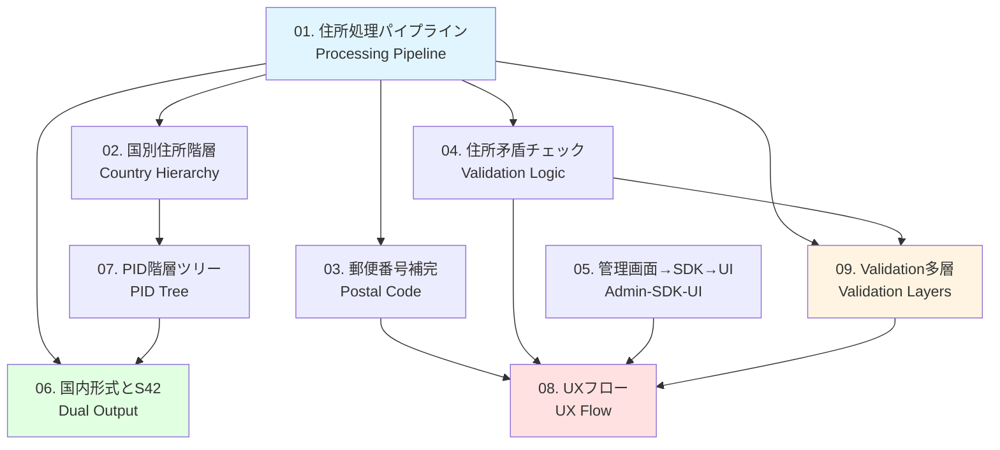

# Veyform アーキテクチャ図集 / Veyform Architecture Diagrams

このディレクトリには、Veyformを「配送できる現実レベル」で説明・実装するための9つの重要な図が含まれています。

This directory contains 9 essential diagrams to explain and implement Veyform at a "delivery-ready production level".

---

## 📚 図の一覧 / Diagram Index

### 必須図 (全体構造) / Essential Diagrams (Overall Structure)

#### 1. [住所処理パイプライン図](./01-address-processing-pipeline.md)
**Veyform Address Processing Pipeline**

Veyformが入力を受け取って、内部正規化 → バリデーション → S42形式生成 → 出力までの流れを一枚で説明。

Shows the complete flow: User Input → Field Validation → AMF/PID Normalization → Structure Check → Domestic Format → S42 Generation → EC Return.

**重要度**: ⭐⭐⭐⭐⭐ (最重要)  
**読者**: 全員 (開発者、プロダクトマネージャー、ビジネス)

---

#### 2. [国別住所階層マップ](./02-country-address-hierarchy.md)
**Country-Specific Address Hierarchy Map**

日本、欧米、中国の3つの代表地域の住所構造の違いを横並びで可視化。Veyformが「国別で階層セットを自動切替する」根拠を視覚化。

Side-by-side comparison of address structures in Japan, Western countries, and China. Demonstrates how Veyform automatically switches hierarchy sets by country.

**重要度**: ⭐⭐⭐⭐⭐  
**読者**: 開発者、国際展開担当

---

### バリデーション・補完の仕組み / Validation & Auto-completion

#### 3. [郵便番号補完フロー図](./03-postal-code-autocomplete.md)
**Postal Code Auto-completion Flow**

郵便番号から行政区を補完する処理の説明。UX改善の要点を示す図として重要。

Explains the process of automatically completing administrative regions from postal codes. Key for UX improvement.

**重要度**: ⭐⭐⭐⭐  
**読者**: UXデザイナー、フロントエンド開発者

---

#### 4. [住所矛盾チェック (Validation AI) ロジック図](./04-address-validation-logic.md)
**Address Validation Check Logic Diagram**

「郵便番号と市区町村の不一致」「スペルミス」「番地の存在チェック」をどの層で検査するか示す。

Shows which layers check for postal code-city mismatches, spelling errors, and block number validation.

**重要度**: ⭐⭐⭐⭐  
**読者**: バックエンド開発者、QA

---

### カスタマイズの構造 / Customization Structure

#### 5. [EC管理画面 → Veyform SDK → UI の関係図](./05-admin-sdk-ui-relationship.md)
**EC Admin Panel → Veyform SDK → UI Relationship**

ECが設定 → SDKに反映 → フォームに表示、という流れ。SaaSとしての流れが一目で分かる。

Admin settings → SDK reflection → Form display flow. Clear visualization of the SaaS flow.

**重要度**: ⭐⭐⭐⭐  
**読者**: フロントエンド開発者、プロダクトマネージャー

---

### 出力形式 / Output Format

#### 6. [国内形式とS42 (国際形式) の二重出力図](./06-dual-output-format.md)
**Dual Output: Domestic and S42 International Format**

1つの入力から2つの出力が生成されることを示す。配送業者に依存しないのに"国際配送可能"である理由を説明できる。

Shows how a single input generates two outputs. Explains why international delivery is possible without carrier dependency.

**重要度**: ⭐⭐⭐⭐⭐  
**読者**: 全員 (特に国際配送担当)

---

### AMF/PIDモデル / AMF/PID Model

#### 7. [PID (Place ID) 階層ツリー図](./07-pid-hierarchical-tree.md)
**PID Hierarchical Tree Diagram**

例: `JP-13-13104-○○○○` のPIDツリー構造図。国境を超えて階層が統一的に扱える理由を図示。

Example PID tree structure like `JP-13-13104-XXXX`. Shows how hierarchies are handled uniformly across borders.

**重要度**: ⭐⭐⭐  
**読者**: バックエンド開発者、データエンジニア

---

### ユーザー体験 / User Experience

#### 8. [UXフロー図](./08-ux-flow.md)
**UX Flow Diagram**

住所入力画面 → 自動補完＋エラーチェック → 整形済み住所の確認画面 → 注文確定。配送事故を減らす"確認フェーズ"の重要性を示せる。

Input screen → Auto-complete + Error check → Confirmation screen → Order complete. Highlights the importance of the confirmation phase for reducing delivery errors.

**重要度**: ⭐⭐⭐⭐⭐  
**読者**: UXデザイナー、プロダクトマネージャー

---

### 住所データの品質保証 / Address Data Quality Assurance

#### 9. [Validation多層図](./09-validation-layers.md)
**Multi-Layer Validation Diagram**

形式チェック → 階層整合性チェック → 地名辞書チェック → AI補正。すべての層がどの順で動くか可視化。

Format Check → Hierarchy Check → Dictionary Check → AI Correction. Visualizes all validation layers in sequence.

**重要度**: ⭐⭐⭐⭐⭐  
**読者**: 開発者全員、QA、アーキテクト

---

## 🎯 読者別推奨図 / Recommended Diagrams by Audience

### 📱 プロダクトマネージャー / Product Manager
優先度順:
1. [住所処理パイプライン](./01-address-processing-pipeline.md) - 全体像把握
2. [UXフロー](./08-ux-flow.md) - ユーザー体験理解
3. [国内形式とS42出力](./06-dual-output-format.md) - 国際対応の仕組み
4. [管理画面→SDK→UI関係](./05-admin-sdk-ui-relationship.md) - SaaS機能理解

### 💻 フロントエンド開発者 / Frontend Developer
優先度順:
1. [UXフロー](./08-ux-flow.md) - 実装すべき画面遷移
2. [郵便番号補完フロー](./03-postal-code-autocomplete.md) - 自動補完実装
3. [管理画面→SDK→UI関係](./05-admin-sdk-ui-relationship.md) - SDK統合
4. [住所処理パイプライン](./01-address-processing-pipeline.md) - 全体フロー

### ⚙️ バックエンド開発者 / Backend Developer
優先度順:
1. [住所処理パイプライン](./01-address-processing-pipeline.md) - 全体フロー
2. [Validation多層図](./09-validation-layers.md) - バリデーション実装
3. [住所矛盾チェック](./04-address-validation-logic.md) - エラー処理
4. [PID階層ツリー](./07-pid-hierarchical-tree.md) - データ構造
5. [国内形式とS42出力](./06-dual-output-format.md) - 出力生成

### 🎨 UXデザイナー / UX Designer
優先度順:
1. [UXフロー](./08-ux-flow.md) - ユーザージャーニー
2. [郵便番号補完フロー](./03-postal-code-autocomplete.md) - 自動補完UX
3. [住所処理パイプライン](./01-address-processing-pipeline.md) - システムフロー
4. [住所矛盾チェック](./04-address-validation-logic.md) - エラー表示

### 🌍 国際展開担当 / International Expansion
優先度順:
1. [国別住所階層マップ](./02-country-address-hierarchy.md) - 各国の違い
2. [国内形式とS42出力](./06-dual-output-format.md) - 国際対応
3. [PID階層ツリー](./07-pid-hierarchical-tree.md) - 国際統一ID
4. [住所処理パイプライン](./01-address-processing-pipeline.md) - 全体フロー

### 🔍 QA / Quality Assurance
優先度順:
1. [Validation多層図](./09-validation-layers.md) - テスト観点
2. [住所矛盾チェック](./04-address-validation-logic.md) - エラーケース
3. [UXフロー](./08-ux-flow.md) - テストシナリオ
4. [郵便番号補完フロー](./03-postal-code-autocomplete.md) - 自動補完テスト

---

## 🔗 図の関連性 / Diagram Relationships



---

## 📖 ドキュメント活用ガイド / Documentation Usage Guide

### 新規メンバーのオンボーディング / New Member Onboarding

**Day 1**:
1. [住所処理パイプライン](./01-address-processing-pipeline.md) - システム全体理解
2. [UXフロー](./08-ux-flow.md) - ユーザー視点理解

**Day 2-3**:
3. [国別住所階層マップ](./02-country-address-hierarchy.md) - 国際対応理解
4. [Validation多層図](./09-validation-layers.md) - 品質保証理解

**Week 1**:
5. [郵便番号補完フロー](./03-postal-code-autocomplete.md)
6. [住所矛盾チェック](./04-address-validation-logic.md)

**Week 2**:
7. [管理画面→SDK→UI関係](./05-admin-sdk-ui-relationship.md)
8. [国内形式とS42出力](./06-dual-output-format.md)
9. [PID階層ツリー](./07-pid-hierarchical-tree.md)

---

### 機能開発時の参照 / Reference During Feature Development

#### 新しいバリデーション機能追加
→ [Validation多層図](./09-validation-layers.md) + [住所矛盾チェック](./04-address-validation-logic.md)

#### 新しい国のサポート追加
→ [国別住所階層マップ](./02-country-address-hierarchy.md) + [PID階層ツリー](./07-pid-hierarchical-tree.md)

#### UI改善
→ [UXフロー](./08-ux-flow.md) + [郵便番号補完フロー](./03-postal-code-autocomplete.md)

#### API設計
→ [住所処理パイプライン](./01-address-processing-pipeline.md) + [国内形式とS42出力](./06-dual-output-format.md)

---

## 🎓 学習パス / Learning Paths

### 基礎コース (2-3時間) / Basic Course
1. 住所処理パイプライン (30分)
2. UXフロー (30分)
3. 国別住所階層マップ (45分)
4. 郵便番号補完フロー (45分)

### 中級コース (4-5時間) / Intermediate Course
基礎コース +
5. Validation多層図 (60分)
6. 住所矛盾チェック (60分)
7. 国内形式とS42出力 (60分)

### 上級コース (8-10時間) / Advanced Course
中級コース +
8. PID階層ツリー (90分)
9. 管理画面→SDK→UI関係 (90分)
10. 実装演習 (120分)

---

## 🔍 よくある質問 / FAQ

### Q1: どの図から読めばいいですか？
**A**: まず [住所処理パイプライン](./01-address-processing-pipeline.md) を読んで全体像を把握し、その後、あなたの役割に応じて上記の「読者別推奨図」を参照してください。

### Q2: 図はどのフォーマットで提供されていますか？
**A**: すべての図はMarkdown形式で、Mermaid図を使用しています。GitHubやほとんどのMarkdownビューアで直接レンダリングできます。

### Q3: 図を印刷できますか？
**A**: はい。各Markdownファイルをブラウザで開き、PDFとして印刷できます。Mermaid図も含めて印刷されます。

### Q4: 図の更新頻度は？
**A**: 機能追加や仕様変更時に随時更新されます。各ファイルの最終更新日をご確認ください。

### Q5: 他の言語版はありますか？
**A**: 現在、日本語と英語の両方で提供されています。各図は日英バイリンガルで記載されています。

---

## 📝 ドキュメント作成者向けガイド / Guide for Documentation Authors

### 図の追加・更新時の注意事項

1. **一貫性**: 既存の図と同じスタイル・形式を維持
2. **バイリンガル**: 日本語と英語の両方で記載
3. **Mermaid図**: 可能な限りMermaid図を使用
4. **実装例**: 必ず実装コード例を含める
5. **関連リンク**: 関連する図へのリンクを追加

### 図のテンプレート構成

```markdown
# タイトル (日本語) / Title (English)

説明文 (日英両方)

---

## 🎯 概要 / Overview

Mermaid図

---

## 📋 詳細 / Details

詳細説明

---

## 🔧 実装例 / Implementation

コード例

---

## 関連ドキュメント / Related Documents

リンク集
```

---

## 📞 お問い合わせ / Contact

- **GitHub Issues**: バグ報告・機能リクエスト
- **Discussions**: 質問・議論
- **Email**: vey-team@example.com

---

## ⚖️ ライセンス / License

MIT License - 詳細は [LICENSE](../../../../LICENSE) をご覧ください。

---

**最終更新 / Last Updated**: 2024-12-07
