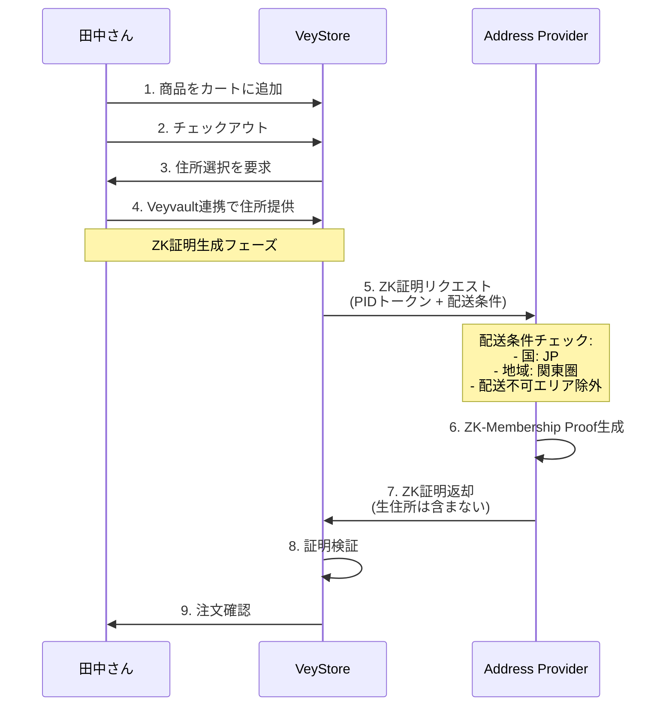
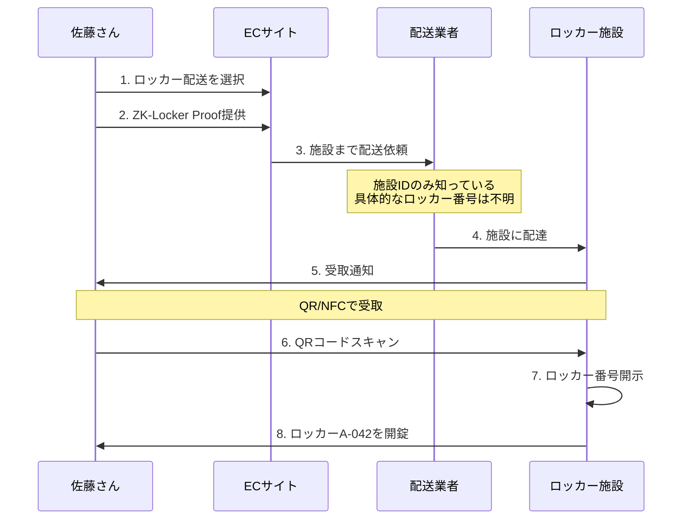
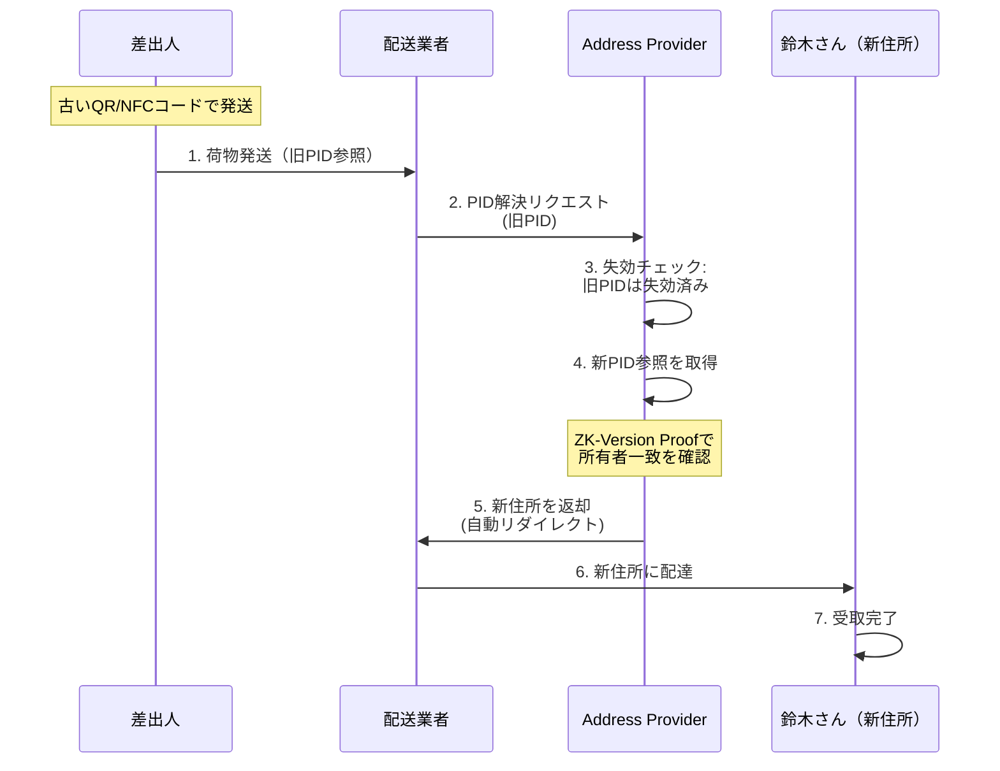

# ZKPアドレスプロトコル - ユースケース集

## 目次

1. [EC配送](#ユースケース1-ec配送)
2. [匿名ロッカー配送](#ユースケース2-匿名ロッカー配送)
3. [引越し時の住所更新](#ユースケース3-引越し時の住所更新)
4. [店舗受取](#ユースケース4-店舗受取)
5. [越境EC配送](#ユースケース5-越境ec配送)
6. [定期配送サブスクリプション](#ユースケース6-定期配送サブスクリプション)

---

## ユースケース1: EC配送

### シナリオ

田中さんはオンラインショッピングで商品を購入します。プライバシーを守りながら、スムーズな配送を実現したいと考えています。

### 登場人物

- **田中さん**: ユーザー（購入者）
- **VeyStore**: ECプラットフォーム
- **Address Provider**: アドレスプロバイダ（Vey）
- **ヤマト運輸**: 配送業者

### フロー詳細

#### ステップ1: 住所登録（初回のみ）

```typescript
// Veyvaultアプリで住所を登録
const registerResult = await veyvault.registerAddress({
  country: 'JP',
  province: '東京都',
  city: '渋谷区',
  street_address: '道玄坂1-2-3',
  building: 'ABCビル',
  room: '501',
  postal_code: '150-0043',
});

// 結果:
// - PID: JP-13-113-01-T07-B12-BN02-R342
// - Address PID VC発行済み
// - QR/NFCコード生成
```

#### ステップ2: 商品購入



**VeyStoreが保存するデータ**:
```json
{
  "orderId": "ORD-2024-001",
  "userId": "田中さんID",
  "items": [...],
  "shippingInfo": {
    "pidToken": "tok_abc123...",  // 匿名化された住所参照
    "zkProof": {
      "circuitId": "membership-v1",
      "proof": "...",
      "publicInputs": {
        "merkleRoot": "0x123...",
        "timestamp": 1701936000000
      }
    },
    "shippingZone": "KANTO-TOKYO"  // 粗い位置情報のみ
  }
}
```

#### ステップ3: 配送

```typescript
// ヤマト運輸がPIDを解決
const deliveryResult = await yamatoAPI.resolvePID({
  pidToken: 'tok_abc123...',
  carrierDid: 'did:web:yamato-transport.co.jp',
  reason: 'last-mile-delivery',
  deliveryDate: '2024-12-08',
});

// 結果: 完全な住所を取得
// {
//   country: 'JP',
//   province: '東京都',
//   city: '渋谷区',
//   street_address: '道玄坂1-2-3',
//   building: 'ABCビル',
//   room: '501',
//   postal_code: '150-0043',
//   recipient: '田中',
// }

// 監査ログに記録:
// - アクセス者: did:web:yamato-transport.co.jp
// - 対象PID: JP-13-113-01-T07-B12-BN02-R342
// - 理由: last-mile-delivery
// - タイムスタンプ: 2024-12-08T10:00:00Z
```

### メリット

✅ **プライバシー保護**: ECサイトは生住所を見ない
✅ **配送の確実性**: ZK証明で配送可能性を保証
✅ **監査可能性**: すべてのアクセスがログ記録される
✅ **ユーザー体験**: ワンクリックで住所選択

---

## ユースケース2: 匿名ロッカー配送

### シナリオ

佐藤さんは自宅住所を公開せず、近隣のコンビニロッカーで受け取りたいと考えています。

### フロー詳細

#### ステップ1: ロッカー予約

```typescript
// 近隣のロッカー施設を検索
const facilities = await veyvault.searchLockerFacilities({
  latitude: 35.6812,
  longitude: 139.7671,
  radius: 1000, // 1km以内
});

// 結果:
// [
//   {
//     facilityId: 'FACILITY-SHIBUYA-STATION',
//     name: 'PUDO渋谷駅東口',
//     availableLockers: 15,
//     distance: 500,
//   },
//   ...
// ]

// ロッカー予約
const reservation = await veyvault.reserveLocker({
  facilityId: 'FACILITY-SHIBUYA-STATION',
  size: 'MEDIUM',
  receiveBy: '2024-12-10',
});

// 結果:
// {
//   lockerId: 'LOCKER-A-042',  // 具体的なロッカー番号（秘匿される）
//   facilityId: 'FACILITY-SHIBUYA-STATION',
//   zone: 'KANTO-TOKYO-SHIBUYA',
//   reservationCode: 'ABC123',
// }
```

#### ステップ2: ZK-Locker Proof生成

```typescript
// ECサイトに施設情報だけを提供
const proof = await veyvault.generateLockerProof({
  lockerId: 'LOCKER-A-042',              // 秘匿
  facilityId: 'FACILITY-SHIBUYA-STATION',  // 公開
  availableLockers: ['LOCKER-A-001', ..., 'LOCKER-A-100'],
  zone: 'KANTO-TOKYO-SHIBUYA',          // 公開
});

// ZK-Locker Proof:
// - 具体的なロッカー番号は秘匿
// - 施設ID、ゾーンのみ公開
// - 施設内ロッカーへのアクセス権を証明
```

#### ステップ3: 配送と受取



### メリット

✅ **完全な匿名性**: ロッカー番号は受取時まで秘匿
✅ **柔軟な受取時間**: 24時間いつでも受取可能
✅ **プライバシー保護**: 自宅住所を公開不要
✅ **配送効率化**: 施設への一括配送

---

## ユースケース3: 引越し時の住所更新

### シナリオ

鈴木さんは引越しをします。新住所に更新しても、既存のQR/NFCコードやサービスを継続利用したいと考えています。

### フロー詳細

#### ステップ1: 新住所登録

```typescript
// 新住所を登録
const newAddress = await veyvault.registerAddress({
  country: 'JP',
  province: '神奈川県',
  city: '横浜市',
  street_address: '西区みなとみらい2-3-5',
  building: 'クイーンズタワー',
  room: '1203',
  postal_code: '220-0012',
});

// 新PID: JP-14-201-05-T03-B08-BN05-R1203
```

#### ステップ2: 住所移行証明

```typescript
// ZK-Version Proof生成
const migrationProof = await veyvault.updateAddress({
  oldPid: 'JP-13-113-01-T07-B12-BN02-R342',  // 旧住所
  newPid: 'JP-14-201-05-T03-B08-BN05-R1203',  // 新住所
  userDid: 'did:key:z6Mk...',
  reason: 'relocation',
});

// ZK-Version Proof:
// - 旧PIDと新PIDの所有者が同一であることを証明
// - 旧PIDは自動的に失効リストに追加
// - 新PIDが有効になる
```

#### ステップ3: 自動リダイレクト



**失効リストエントリ**:
```json
{
  "pid": "JP-13-113-01-T07-B12-BN02-R342",
  "revokedAt": "2024-12-01T00:00:00Z",
  "reason": "address_change",
  "newPid": "JP-14-201-05-T03-B08-BN05-R1203",
  "zkVersionProof": {
    "circuitId": "version-v1",
    "proof": "...",
    "publicInputs": {
      "oldPid": "JP-13-113-01...",
      "newPid": "JP-14-201-05...",
      "migrationTimestamp": 1701388800000
    }
  }
}
```

### メリット

✅ **サービス断絶なし**: 既存のQR/NFCコード継続利用
✅ **セキュリティ**: 所有者一致をZK証明で保証
✅ **自動転送**: 旧住所宛の荷物も新住所に配達
✅ **通知不要**: EC・配送業者への連絡不要

---

## ユースケース4: 店舗受取

### シナリオ

高橋さんはオンラインで注文し、近くの店舗で受け取りたいと考えています。

### フロー詳細

```typescript
// 受取店舗を選択
const storePickup = await veyvault.selectStorePickup({
  storeId: 'STORE-SHIBUYA-001',
  storeName: 'ビックカメラ渋谷東口店',
  pickupBy: '2024-12-10',
});

// ZK-Structure Proof生成
// 店舗が配送可能エリアにあることを証明
const proof = await veyvault.generateStructureProof({
  storePid: 'JP-13-113-01-STORE-SHIBUYA-001',
  countryCode: 'JP',
  hierarchyDepth: 6,
});

// ECサイトに提供
// - 店舗ID: STORE-SHIBUYA-001
// - ZK証明: 正当な店舗PIDであることの証明
// - 受取予定日: 2024-12-10
```

### メリット

✅ **配送料無料**: 店舗受取で配送コスト削減
✅ **即日受取**: 店舗在庫があれば当日受取可能
✅ **確実な受取**: 不在の心配なし

---

## ユースケース5: 越境EC配送

### シナリオ

山田さんは日本から米国の友人に商品をプレゼントしたいと考えています。

### フロー詳細

```typescript
// 友人の住所（米国）
const friendAddress = {
  country: 'US',
  state: 'CA',
  city: 'Los Angeles',
  zipCode: '90001',
  street: '123 Main St',
  apartment: 'Apt 5B',
};

// ZK-Selective Reveal Proof
// 国・州のみECサイトに公開
const proof = await veyvault.generateSelectiveRevealProof({
  pid: 'US-CA-90001-W01-S05-B123-U5B',
  fullAddress: friendAddress,
  fieldsToReveal: ['country', 'state', 'zipCode'],  // 公開フィールド
  pattern: 'selective-reveal',
});

// ECサイトが受け取るデータ:
// {
//   country: 'US',
//   state: 'CA',
//   zipCode: '90001',
//   // 詳細住所は秘匿
// }

// 国際配送業者（DHL/FedEx）には完全な住所を開示
```

### メリット

✅ **国際配送対応**: 米国の階層構造も対応
✅ **関税計算**: 国・州で関税を自動計算
✅ **プライバシー保護**: ECには最小限の情報のみ

---

## ユースケース6: 定期配送サブスクリプション

### シナリオ

伊藤さんは毎月食材の定期配送を利用しています。

### フロー詳細

```typescript
// サブスクリプション登録
const subscription = await veyvault.createSubscription({
  providerId: 'OISIX-SUBSCRIPTION',
  pidToken: 'tok_xyz789...',
  frequency: 'monthly',
  dayOfMonth: 15,
  autoRenew: true,
});

// 毎月の配送時にZK証明を自動生成
// - 住所が有効であることを証明
// - 配送可能エリアであることを確認
// - ユーザーの承認なしで自動配送

// 引越し時も自動対応
// - ZK-Version Proofで新住所を証明
// - サブスクリプション継続
// - 再登録不要
```

### メリット

✅ **自動配送**: 毎回の住所入力不要
✅ **引越し対応**: 自動的に新住所に配送
✅ **プライバシー**: 継続的な配送でも住所秘匿

---

## ユースケース比較表

| ユースケース | ZKPパターン | プライバシーレベル | 配送速度 | 適用シーン |
|------------|-----------|-----------------|---------|----------|
| **EC配送** | Membership, Selective | 高 | 通常 | 一般的なオンライン購入 |
| **匿名ロッカー** | Locker | 最高 | 通常〜遅 | プライバシー重視 |
| **引越し** | Version | 高 | - | 住所変更時 |
| **店舗受取** | Structure | 中 | 速い | 即日受取希望 |
| **越境EC** | Selective, Structure | 高 | 遅い | 国際配送 |
| **サブスク** | Membership, Version | 高 | 通常 | 定期配送 |

---

## まとめ

ZKPアドレスプロトコルは、多様な配送シナリオに対応可能な柔軟なシステムです。

### 共通メリット

- 🔐 **プライバシー保護**: 住所情報の選択的開示
- ✅ **検証可能性**: ZK証明による配送可能性の保証
- 🔄 **継続性**: 住所変更時もサービス継続
- 📊 **監査可能性**: すべてのアクセスがログ記録

---

**最終更新**: 2024-12-07
